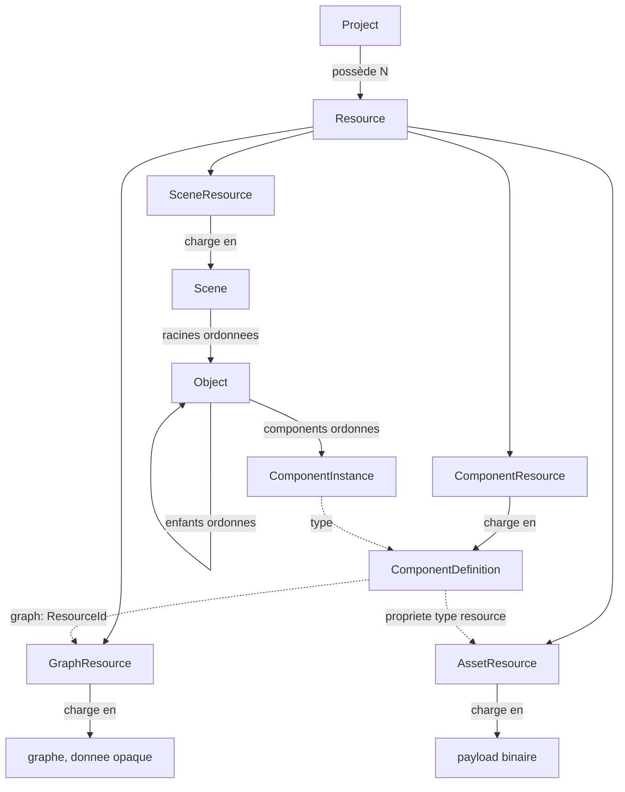
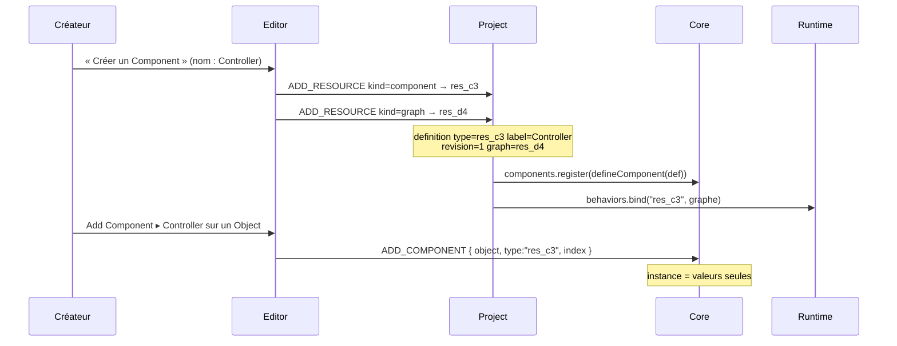

# Audit architectural — fondations du modèle de données

> **Nature :** audit et **proposition** d'architecture. Ce document n'est pas une décision.
> **Date :** 2026-08-14
> **Vérifié contre :** `HEAD = 19107304aabaeee5a29c340c3f4d81d7219de490` (`docs: move reference documentation`), aligné avec `origin/master`.
> **État d'implémentation : AUCUN.** Rien de ce document n'est écrit dans `src/`. Aucun fichier de code n'a été créé ni modifié.

---

## 0. Comment lire ce document

### 0.1 Son rôle par rapport aux ADR

**ADR = Architecture Decision Record** — un enregistrement de décision d'architecture. Les
ADR du dépôt (`docs/decisions/ADR-XXXX-*.md`) enregistrent des décisions **prises**, datées
et acceptées. Ils font autorité.

**Ce document ne fait pas autorité.** C'est un audit du code réel suivi d'une proposition
d'architecture. Il occupe la place qui précède un ADR : il expose ce qui existe, ce qui
manque, ce qui est proposé, et ce qui reste à arbitrer. Une décision retenue ici deviendra
un ADR à part entière (§10) ; tant qu'elle n'en est pas un, elle reste une proposition.

Aucun ADR existant n'a été modifié pour faire correspondre son contenu à cette proposition.
Là où la proposition ferait évoluer une décision déjà écrite, c'est signalé nommément
(§8.2, §5.4) et soumis à arbitrage.

### 0.2 Étiquetage des affirmations

`CONVENTIONS.md` impose d'étiqueter la nature de toute affirmation. Ce document utilise les
quatre étiquettes canoniques, plus une cinquième nécessaire ici :

| Étiquette | Sens |
|---|---|
| **OBSERVÉ** | vérifié dans le code du dépôt, à la révision indiquée en tête |
| **DÉCIDÉ (ADR-XXXX)** | tranché par un ADR accepté — fait autorité |
| **DÉCISION VALIDÉE (2026-08-14)** | tranché par le mainteneur dans l'échange qui a produit ce document, **pas encore consigné dans un ADR** |
| **PROPOSITION** | recommandation de cet audit — non implémentée, non décidée |
| **À ARBITRER** | demande une décision explicite du mainteneur avant toute implémentation |

L'étiquette **DÉCISION VALIDÉE** est un ajout aux quatre de `CONVENTIONS.md`. Elle existe
parce qu'une décision peut être prise avant d'être consignée ; elle est transitoire par
construction, et disparaît quand l'ADR correspondant est écrit.

### 0.3 Avertissement de vocabulaire — deux numérotations de « phase »

Deux découpages en phases coexistent dans la documentation, et ils ne parlent pas de la
même chose :

| Numérotation | Où | Sens |
|---|---|---|
| **Phase 0**, puis étapes 1, 2, 2.8, 3, 3.5, 4… | `migration/MIGRATION_STATUS.md` | l'avancement de la migration Legacy → v2. **Phase 0 est close.** L'étape courante est la 4 |
| **Phase 1, Phase 2, Phase 3** | ce document | le découpage du seul chantier « fondations du modèle de données » : audit (1), proposition (2), implémentation (3) |

Ce document est la **Phase 2 du chantier**, à l'intérieur de l'**étape 4 de la migration**.
La « Phase 3 » qu'il évoque est l'implémentation de ses propres propositions, pas une phase
de migration.

### 0.4 Méthode, et ce qu'elle ne couvre pas

Ce qui a été fait : lecture des refs et du reflog Git ; lecture de `src/core`, `src/runtime`,
`src/editor`, des 17 ADR, de `ARCHITECTURE.md` et de `MIGRATION_STATUS.md` ; exécution de la
suite de tests et du contrôle de couches sur une copie du dépôt ; une sonde d'exécution
jetable, hors dépôt, pour **mesurer** le comportement de l'ordre et de la sérialisation au
lieu de le déduire du code.

Limites, à connaître :

| Limite | Conséquence |
|---|---|
| Aucun shell n'était exposé sur la machine du mainteneur | **`git status` n'a pas pu être exécuté.** La propreté du working tree est déduite de dates de modification, pas vérifiée |
| `legacy/` et `tools/parity/baseline/` non copiés | **`tools/parity/run.js` n'a pas été exécuté.** Les 39 scénarios de parité ne sont pas revalidés ici |

Résultats obtenus :

```
tools/test.sh              497 tests, 497 passés, 0 échec
node tools/layers/run.js   profil v2 : 0 import interdit sur 325 imports
                           profil legacy : ignoré (legacy/ absent de la copie)
```

---

## 1. Décisions validées avant lecture

Quatre décisions ont été prises par le mainteneur au cours de cet audit. Elles ne sont pas
des propositions et ne doivent pas être rediscutées ici. **Aucune n'est encore consignée
dans un ADR** (§10).

### 1.1 L'ordre des Components est signifiant et persistant

**DÉCISION VALIDÉE (2026-08-14).** L'ordre des Components d'un `Object` fait partie de
l'état persistant du projet. Il n'est pas une préférence d'affichage. Voir §4.

### 1.2 Le réordonnancement est une mutation du Core

**DÉCISION VALIDÉE (2026-08-14).** Réordonner des Components, des enfants ou des objets
racines est une mutation structurelle du Core, représentable par une Operation, donc
compatible avec la réplication et l'Undo/Redo. Ce n'est pas un comportement d'Editor. Voir §6.

### 1.3 Une définition de Component a une identité stable distincte de son nom

**DÉCISION VALIDÉE (2026-08-14).** Renommer une définition ne doit pas casser les instances
existantes. Voir §5.2.

### 1.4 `.px` reste une ressource JSON interprétée par le Runtime

**DÉCISION VALIDÉE (2026-08-14),** en cohérence avec **ADR-0009**, **ADR-0015** et
**ADR-0016** : le Core ne l'interprète pas ; le graphe appartient au type/définition et est
partagé par les instances ; chaque instance garde son propre état d'exécution. Voir §9.

### 1.5 Terminologie : `Graph`, jamais `Composer`

**DÉCISION VALIDÉE (2026-08-14).** L'éditeur visuel de graphes s'appelle **`Graph`** en
anglais, **« graphe »** ou **« éditeur de graphe »** en français.

> **`Composer` est réservé** à une éventuelle future fenêtre de composition musicale. Ce
> terme ne doit désigner l'éditeur de graphes nulle part — ni dans l'UI, ni dans la
> documentation, ni dans les commentaires de code.

La distinction à ne pas perdre :

| Terme | Ce qu'il désigne | Couche |
|---|---|---|
| **`Graph`** | le graphe en tant que notion produit, et la fenêtre qui l'édite | produit / Editor |
| **`GraphResource`** | la **ressource persistée** qui porte les données du graphe (§3) | Project |
| le **graphe** (donnée) | la structure `{ version, nodes, connections, variables, metadata }` d'ADR-0009 | donnée, transportée par le Core, interprétée par le Runtime |

Une fenêtre `Graph` édite une `GraphResource`, dont le payload est un graphe.

**OBSERVÉ.** Le terme `Composer` n'apparaît nulle part dans `docs/`. Il apparaît **une fois**
dans le code, dans un commentaire : `src/editor/ui/tabs.js:10` — *« Project alongside a
Composer »*. **Correction à faire en Phase 3** : ce commentaire doit dire `Graph`. Il n'a pas
été modifié ici, cette étape étant documentaire.

### 1.6 `Object` n'est pas un Component, et reste une section intrinsèque de l'Inspector

**DÉCISION VALIDÉE (2026-08-14).** Deux affirmations, à tenir ensemble.

**`Object` n'est pas un Component.** Il n'est pas rangé dans `object.components`, ne
s'attache pas, ne se détache pas, n'a pas de schéma de Component. `name`, `tag`, `layer`,
`active`, `visible`, `lock`, `owner` sont des propriétés intrinsèques de l'`Object`
(**OBSERVÉ** : `src/core/object.js:46-52`, et `src/core/serialize.js:28` en fixe la liste
sérialisée). Cela reste conforme à **ADR-0001** et **ADR-0002** : ce qui a été sorti de
l'`Object` vers un Component, c'est le placement (`Transform`), pas l'identité.

**`Object` reste une section intrinsèque de l'Inspector.** Le créateur doit pouvoir éditer
le nom et le tag depuis l'Inspector, sans que cela fasse de l'`Object` un faux Component.

```
Inspector
├── Object                ← section intrinsèque, PAS un Component
│   ├── Name
│   └── Tag
├── Transform             ← Component
│   ├── Position
│   ├── Rotation
│   └── Scale
└── …                     ← les autres Components
```

**OBSERVÉ — c'est déjà le comportement du dépôt, cette décision le confirme :**

- `src/editor/inspector/schema.js` exporte `objectFields()`, une liste **écrite à la main**
  (`name`, `tag`, `layer`, `active`), distincte de `describeComponent()` qui, lui, lit un
  schéma ou réfléchit sur une instance ;
- `src/editor/windows/inspector.js` rend une section `Object` **au-dessus** des Components,
  alimentée par `objectFields()` ;
- `visible` et `lock` en sont absents volontairement : la ligne de Hierarchy les porte, où
  ils sont accessibles pour tous les objets à la fois. `id` est absent parce qu'un créateur
  n'en a pas l'usage.

**Compatibilité avec l'architecture Operations.** Aucune adaptation n'est nécessaire :
`Object.setProperty()` produit déjà une Operation dont la cible est
`{ object: id, component: null }` (`src/core/object.js:160-168`). Le `component: null`
**est** la façon dont le format exprime « une propriété intrinsèque de l'Object ». Éditer
`name` depuis l'Inspector est donc déjà une mutation répliquable et annulable.

**Conséquence sur la proposition §4.1 :** le passage de `components` à une collection
ordonnée ne touche **pas** la section `Object` — elle n'est pas dans cette collection.

> **Note de lecture du croquis.** Dans l'Inspector, `Object` et `Transform` apparaissent au
> même niveau visuel. Cette platitude d'affichage ne dit rien du modèle : `Transform` est un
> Component rangé dans `object.components`, `Object` ne l'est pas.

---

## 2. Ce que le modèle est aujourd'hui — constats de l'audit

**OBSERVÉ.** Toutes les affirmations de cette section ont été revérifiées contre `HEAD`.

### 2.1 Table de vérification

| Constat | Emplacement |
|---|---|
| Les Components sont stockés dans une `Map`, l'ordre est l'ordre d'attachement | `core/object.js:56` |
| Les enfants sont un tableau ; `addChild` ajoute **toujours en fin** | `core/object.js:59`, `:297` |
| Les racines d'une Scene se déduisent par filtrage de l'ordre d'insertion d'une `Map` | `core/scene.js:167-169` |
| La sérialisation **trie les Components par ordre alphabétique** | `core/serialize.js:151-155` |
| Le Runtime exécute les Components **dans l'ordre d'attachement** | `core/runtime.js:113`, `runtime/runtime.js:137-141` |
| `OperationType` ne contient que `SET_PROPERTY` | `core/operations/operation.js:11` |
| `Operations.register(type, handler)` existe et **n'a aucun consommateur** | `core/operations/operations.js:67` |
| `seq` est un compteur **de module**, partagé par tout le processus | `core/operations/operation.js:14` |
| `Matrix` n'a **pas** de `decompose()` | `core/math/matrix.js` |
| L'interdiction de cycle vit dans `addChild`, pas dans une Operation | `core/object.js:291` |
| `describeType()` lit déjà `ComponentClass.label` | `editor/registry.js:59-63` |
| `Sprite` déclare déjà `source: { type: 'resource', default: null }` | `runtime/rendering/components/sprite.js:12` |
| `Tilemap` déclare `tiles` et `palette` en `type: 'array'` | `runtime/rendering/components/tilemap.js:21-22` |
| `src/network/` et `src/project/` n'existent pas | — |
| `Resource` n'existe pas dans `src/` | — |
| `Document` n'existe nulle part : ni code, ni ADR, ni `ARCHITECTURE.md` | — |
| `px-tabs` est une primitive complète **sans consommateur**, conservée délibérément | `editor/ui/tabs.js` |

### 2.2 Correction d'une affirmation d'un rapport antérieur

Le rapport d'audit de Phase 1 affirmait que le type `resource` « n'existe nulle part ».
**C'est faux :** `Sprite.source` le déclare depuis l'étape 2.8, et `Tilemap` déclare deux
propriétés `array`. Les trois retombent en `READONLY` dans l'Inspector.

Conséquence : `resource` et `array` ne sont pas des types hypothétiques à ajouter pour
compléter une liste. **Trois propriétés de composants livrés ne sont pas éditables
aujourd'hui.** Et `Sprite.source` est déjà une référence vers une ressource, dans un moteur
qui n'a pas de notion de ressource : le trou `Resource` n'est pas seulement devant, il est
déjà ouvert derrière.

### 2.3 Le défaut central, mesuré

Sonde exécutée hors dépôt sur le Core réel :

```
ordre d'attachement (= ordre d'exécution Runtime, = ordre Inspector) : [ Zeta, Alpha ]
ordre des clés sérialisées                                           : [ Alpha, Zeta ]
après aller-retour serialize → deserialize                           : [ Alpha, Zeta ]

ordre des enfants                        : [ a, b ]
enfants après aller-retour               : [ a, b ]     ← préservé
valeurs d'un Component après remove+add  : 42 → 1       ← perdues
```

Deux fichiers du Core s'opposent :

| Fichier | Affirmation |
|---|---|
| `core/serialize.js:151` | *« component type carries no ordering meaning »* → tri alphabétique |
| `runtime/runtime.js:113` | *« runs […] in scene insertion order »* → l'ordre d'attachement **est** l'ordre d'exécution |

**Conséquence concrète, aujourd'hui, sans rien changer : sauvegarder puis recharger un
projet change l'ordre d'exécution des Components d'un objet.** Deux Components dont l'un lit
ce que l'autre écrit dans le même pas ne se comportent pas pareil avant et après une
sauvegarde. La décision §1.1 tranche ce conflit en faveur de l'ordre signifiant.

---

## 3. Proposition — Project / Resource, et pourquoi pas de `Document`

### 3.1 Le schéma proposé

**PROPOSITION.**



Trait plein = possession et sérialisation. Trait pointillé = référence par identifiant.

Deux règles gouvernent tout le schéma :

1. **Une seule chose possède une donnée.** Ce qui est possédé est sérialisé en ligne ; tout
   le reste est une référence par `ResourceId`.
2. **Un identifiant n'est jamais un nom, jamais un chemin.** Ni pour une ressource, ni pour
   une définition de Component, ni pour un Object. C'est **ADR-0010** appliqué au-delà des
   jeux.

### 3.2 `Resource` — l'unité unique

**PROPOSITION.** `Resource` est l'unité d'identité, de stockage, de chargement et de
référence du projet. `kind ∈ { scene, component, graph, asset }`.

| | |
|---|---|
| **Identité** | `ResourceId` opaque (`createId()`), **immuable pour toujours**, indépendante du nom et du chemin |
| **Contient** | `id`, `kind`, `name` (affiché, modifiable), `path` (rangement, indicatif), `formatVersion`, payload |
| **Ne contient surtout pas** | une référence par chemin ; de l'état d'exécution ; de l'état d'Editor |
| **Propriétaire** | couche **Project** |
| **Persistance** | JSON pour scene/component/graph ; payload binaire hors JSON pour asset |

```json
{
  "format": 1,
  "id": "prj_9k2m",
  "name": "Mon jeu",
  "resources": [
    { "id": "res_c3", "kind": "component", "name": "Controller", "path": "components/" },
    { "id": "res_d4", "kind": "graph",     "name": "Controller", "path": "components/" },
    { "id": "res_e5", "kind": "asset",     "name": "player.png", "path": "sprites/", "mime": "image/png" }
  ]
}
```

- `id` : identité. Jamais dérivée du nom ni du chemin, jamais réutilisée.
- `name` : affichage. Modifiable, non unique, sans effet sur les références.
- `path` : rangement. Le déplacer ne casse rien.

**Déplacer un projet** : les chemins changent, les ids non → rien à faire.
**Copier un projet** : ids identiques, cohérence interne préservée → rien à faire.
**Importer une ressource d'un autre projet** : seul cas de collision concevable ; le
traitement honnête est une passe de remappage à l'import. **À ne pas construire maintenant.**

C'est exactement le défaut de Legacy que `ARCHITECTURE.md` §9 relève : `id = path + name`,
donc renommer un fichier change son identité.

### 3.3 `Asset` — concept évalué et rejeté

**PROPOSITION.** `Asset` n'existe pas comme entité distincte. Une image est une `Resource` de
`kind: 'asset'` dont le payload vit hors du JSON.

En faire un pair de `Resource` créerait deux schémas d'identité, deux formes de référence
dans les propriétés, deux chemins de chargement et de réplication, et une question sans
réponse : pourquoi une image serait-elle un `Asset` et un `.px` une `Resource`, alors qu'une
propriété les référence de la même façon ?

Le mot « asset » reste un mot d'interface — le panneau peut s'appeler ainsi — pas un concept
du modèle.

### 3.4 `Document` — concept évalué et rejeté

**PROPOSITION.** Il n'y a pas de `Document` dans le modèle.

| Ce que `Document` apporterait | Qui le détient déjà |
|---|---|
| identité | `Resource.id` |
| contenu | payload de la `Resource` |
| persistance | `ResourceStore` |
| état « modifié » | dérivable du pipeline `Operations` de la ressource chargée |
| pile d'undo | l'historique, **par ressource**, donc déjà indexable par `ResourceId` |
| état de vue (scroll, zoom, repli) | **état d'Editor, qui ne doit jamais entrer dans le projet** |

`Document` serait donc soit un alias de `Resource`, soit un mélange de modèle et d'état
d'IDE. La seconde forme est précisément l'erreur que `core/scene.js` documente en tête de
fichier à propos de `scene.current` de Legacy, et que **ADR-0017** pose comme règle pour la
sélection.

**Ce que `px-tabs` ouvre s'appelle un `OpenEditor`** : un objet de la couche Editor,
`{ resourceId, kind, viewState, history }`, jamais sérialisé dans le projet. Son éventuelle
persistance (« quels onglets étaient ouverts ») appartient à un **workspace** — un artefact
jetable, séparé du projet, dont la perte ne coûte rien.

### 3.5 `ResourceStore` — le seul point de contact avec le stockage

**PROPOSITION.** Une interface, plusieurs implémentations, aucune dans le Core :

```
ResourceStore
  list()            → entrées du manifeste
  read(id)          → payload
  write(id, data)   → persiste
  delete(id)
```

| Backend | Quand | Ce qu'il change |
|---|---|---|
| mémoire | tests, démarrage | rien |
| IndexedDB | mode local / hors ligne (`Store` déjà écrit et inutilisé, `ARCHITECTURE.md` §9) | l'implémentation seule |
| HTTP / distant | plus tard | l'implémentation seule, plus une politique de cache |

Chargement **paresseux et par id** : ouvrir un projet lit le manifeste, pas les payloads.
Les payloads binaires ne sont **jamais** en base64 dans le JSON d'une scène — corrige le
défaut relevé par `ARCHITECTURE.md` §9, et évite qu'un instantané de scène répliqué
transporte des images.

### 3.6 Une nouvelle couche `src/project/`

**PROPOSITION.**

```
editor/  ──►  project/  ──►  core/
runtime/ ──►  core/
core/    ──►  (rien)
```

`project/` n'importe ni le DOM, ni `runtime/`, ni `editor/`. Un serveur headless doit
pouvoir charger un projet — c'est ce qu'impose **ADR-0011** (le serveur autoritaire charge
les mêmes définitions et les mêmes scènes que le client).

**Alternative rejetée :** mettre le chargement dans `editor/`. Un serveur ne peut pas
dépendre d'un IDE.

**Impact outillage :** `tools/layers/rules.js` devra déclarer la couche `project` et les
interdictions `project → editor`, `project → runtime`, `core → project`. Sans quoi le
contrôle de couches laisserait passer une inversion.

---

## 4. Proposition — collections ordonnées

### 4.1 La forme du stockage

**PROPOSITION.** Le problème mesuré au §2.3 n'est pas l'absence d'API, c'est la **forme du
conteneur**. Une `Map` sérialisée en objet JSON trié ne peut pas porter un ordre.

`components` devient une **collection ordonnée, sérialisée en tableau** :

```json
"components": [
  { "type": "Transform",         "values": { "x": 0, "y": 40 } },
  { "type": "res_c3",            "values": { "speed": 120 } },
  { "type": "RectangleRenderer", "values": { "width": 64 } }
]
```

Pourquoi un tableau plutôt qu'un champ `order` dans un objet :

- un tableau **est** ordonné ; un champ `order` est un ordre qu'il faut maintenir cohérent,
  valider, et réparer quand il ne l'est pas ;
- il n'y a plus de tri à supprimer dans `serialize.js` : il n'y a plus rien à trier ;
- deux sérialisations du même modèle restent identiques octet pour octet — ce que le tri
  cherchait à garantir, et qu'un tableau obtient sans détruire l'information.

Le même raisonnement s'applique aux racines : **la Scene tient une liste ordonnée de
racines**, sérialisée `roots: [id, id, …]`, exactement comme `children` l'est déjà pour un
`Object`. `roots()` la renvoie au lieu de filtrer.

**`FORMAT_VERSION` passe de 1 à 2.** Aucune migration de données à écrire : il n'existe pas
de projet v1 (**ADR / Q6**, `ARCHITECTURE.md` §10).

### 4.2 Ce que l'ordre signifie, désormais explicitement

**PROPOSITION.** Une fois ce chantier fait, une seule phrase, écrite à un seul endroit :

> L'ordre des Components d'un `Object` est l'ordre dans lequel le Runtime exécute leur
> `update`, et l'ordre dans lequel l'Inspector les affiche. C'est le même ordre. Il est
> persistant.

Cela résout la contradiction du §2.3 **par le haut** : `serialize.js` cesse d'affirmer que
l'ordre n'a pas de sens, parce qu'il en a un.

L'ordre de **dessin** reste gouverné par `layer` puis par l'ordre de la scène
(`SceneRenderer.#drawOrder`, tri stable) — inchangé, et volontairement distinct de l'ordre
d'`update`.

---

## 5. Proposition — Components utilisateur

### 5.1 Le cycle complet



### 5.2 Identité stable vs nom affiché

**PROPOSITION**, mettant en œuvre la **DÉCISION VALIDÉE §1.3**.

> Le champ `type` devient l'identité stable, jamais éditable par le créateur.
> Le champ `label` devient le nom affiché, librement modifiable.

| | Component natif | Component utilisateur |
|---|---|---|
| `static type` | `'Transform'` — figé dans le code | `'res_c3'` — le `ResourceId` de sa définition |
| `static label` | `'Transform'` (implicite) | `'Controller'` — modifiable |

Trois raisons qui font que ce choix coûte presque rien :

1. **La couture existe déjà.** `editor/registry.js:59-63` lit
   `ComponentClass?.label ?? shipped?.label ?? type`.
2. **Le registre et la sérialisation continuent de fonctionner à l'identique** : ils clefent
   par `type`, qui reste une chaîne opaque.
3. **Renommer devient un `SET_PROPERTY` sur le `label` de la définition.** Aucune instance
   n'est touchée, aucune scène réécrite, aucun projet cassé.

**Asymétrie assumée** — `type` lisible pour un natif, opaque pour un composant utilisateur :
le nom d'un composant natif est du code, donc stable par nature ; celui d'un composant
utilisateur est de la donnée, donc instable par nature. **→ Point d'arbitrage n° 4 (§11).**

### 5.3 Forme d'une définition

**PROPOSITION.**

```json
{
  "format": 1,
  "type": "res_c3",
  "label": "Controller",
  "revision": 3,
  "icon": "component",
  "category": "Gameplay",
  "properties": {
    "speed":  { "type": "number",   "default": 120, "min": 0 },
    "target": { "type": "resource", "kind": "scene", "default": null }
  },
  "graph": "res_d4"
}
```

`icon` et `category` sont déjà honorés par `editor/registry.js` via `ComponentClass.category`
— donc gratuits.

### 5.4 Le graphe référencé par id — écart signalé avec ADR-0016

**PROPOSITION — À ARBITRER.** **ADR-0016** montre, dans son exemple JSON, le graphe **en
ligne** dans la définition : `"graph": { "version": 1, "nodes": [], … }`. La proposition est
que la définition référence son graphe **par `ResourceId`** : `"graph": "res_d4"`.

Ce n'est pas une contradiction du raisonnement d'ADR-0016 — son §5 pose que « pour le Core,
un graphe est une donnée » et son tableau de points ouverts laisse explicitement en suspens
« le format de fichier et le stockage d'une définition (une ressource) ». Mais l'exemple
écrit montre l'autre forme, et **cela demande donc un accord explicite.**

Arguments pour la référence : un graphe en ligne empêcherait d'ouvrir `Controller.px` dans
une fenêtre `Graph` sans ouvrir aussi le fichier de définition, et ferait diverger deux
copies du même graphe.

**→ Point d'arbitrage n° 1 (§11).**

### 5.5 Évolution d'une définition, et le sort des instances

**PROPOSITION.** Trois stratégies évaluées :

| | **S1 — Réconciliation structurelle** ★ | **S2 — Versions + migrations** | **S3 — Rien** |
|---|---|---|---|
| Principe | au chargement, les valeurs stockées sont filtrées par le schéma courant : clés inconnues jetées, clés manquantes remplies par le défaut | chaque définition porte une version ; l'instance stocke la sienne ; des scripts de migration montent les instances | les instances gardent ce qu'elles ont |
| Ajouter une propriété | défaut appliqué ✅ | ✅ | absente ❌ |
| Retirer une propriété | valeur jetée ✅ | ✅ | valeur fantôme sérialisée ❌ |
| Renommer une propriété | perd la valeur | possible | perd la valeur |
| Complexité | **très faible** | élevée | nulle mais incorrecte |
| Déterminisme réseau | total | dépend des scripts | mauvais |

**Recommandation : S1.** **ADR-0016** §4 pose déjà qu'« une instance neuve a exactement les
propriétés déclarées » et que « le schéma d'un composant défini est nécessairement
exhaustif ». S1 n'est que l'application de cette règle **au chargement** et non seulement à
la construction.

Le seul cas non couvert est le **renommage d'une propriété**. Le remède honnête, le jour où
le besoin se présente, est un champ de donnée sur le descripteur (`previousNames: [...]`) lu
par la réconciliation. **À ne pas construire maintenant.**

`revision` sert à deux choses et deux seulement : dire à `Behaviors` qu'un graphe a changé,
et dire à l'Editor qu'un panneau doit se reconstruire. **Les instances ne stockent pas de
`revision`** — c'est ce qui garde S1 simple.

### 5.6 Suppression d'une définition encore utilisée

**PROPOSITION.** Le comportement actuel serait un `throw` de `registry.create()` au
chargement, et une scène entière perdue.

Proposition : la désérialisation d'un Component de type inconnu **ne jette pas** ; elle
produit un `MissingComponent` qui conserve intégralement ses valeurs sérialisées, son type
et son index, ne s'exécute pas, et se signale dans l'Inspector.

Perdre une scène parce qu'un fichier manque est le pire comportement possible pour un
éditeur. Un placeholder qui préserve les données permet de restaurer la définition et de
retrouver le projet intact.

**Point volontairement laissé ouvert :** un serveur autoritaire doit-il, lui, **refuser** de
charger une scène incomplète ? C'est une décision de politique serveur, hors périmètre de
cet audit.

---

## 6. Proposition — hiérarchie, réordonnancement, reparentage

### 6.1 `REPARENT` unifié

**PROPOSITION**, mettant en œuvre la **DÉCISION VALIDÉE §1.2**.

`UNPARENT` ne doit pas être une Operation distincte : `REPARENT` avec `parent: null` le
couvre exactement. Raisons : son inverse est un `REPARENT` (deux opérations qui s'inversent
l'une l'autre sont la même opération) ; `Object.addChild()` détache déjà de l'ancien parent,
donc « ajouter un enfant » *est* un reparentage ; deux opérations pour une mutation, c'est
deux règles d'inversion, deux validations de cycle, deux chemins de réplication.

Et, point le plus structurant de la proposition :

> **`REPARENT` porte aussi l'index.** Il couvre alors : reparenter, détacher, réordonner
> parmi ses frères, et réordonner parmi les racines.

Le geste réel dans une Hierarchy est un dépôt *entre deux lignes* — il change le parent **et**
la position, atomiquement. Les séparer produirait deux opérations qui doivent toujours voyager
ensemble, s'annuler ensemble, et dont l'ordre importe.

Par symétrie : **les racines d'une Scene sont les enfants d'un parent implicite `null`.**
Réordonner une racine, c'est `REPARENT { parent: null, index }`. Un seul modèle mental, une
seule opération, un seul inverse.

### 6.2 Les primitives Core

**PROPOSITION.**

| Primitive | Portée | Pourquoi cette forme |
|---|---|---|
| `object.moveComponent(component, index)` | Object | Un Component ne change pas de propriétaire, seulement de rang |
| `scene.reparent(object, parent, index)` | Scene | **Remplace `moveChild` et `moveRoot`.** Réordonner parmi ses frères = reparenter vers le même parent à un autre index ; réordonner une racine = reparenter vers `null` |

Pourquoi `reparent` porté par la **Scene** et non par l'`Object` : réordonner une racine n'a
pas d'`Object` propriétaire — c'est la Scene qui possède la liste ; un reparentage touche
**deux** parents, le faire porter par l'un des deux est arbitraire ; et la Scene est déjà
propriétaire du pipeline `Operations` et résolveur d'identité.

`addChild` / `removeChild` restent, inchangés, comme raccourcis conservant le transform local
— c'est ce qu'un script attend et ce que `editor/project/starter.js` utilise.

### 6.3 Cycles

**PROPOSITION.** La garde existe déjà (`core/object.js:291`, `isAncestorOf`) mais elle vit
dans `addChild`. Elle doit être portée par le **gestionnaire de l'Operation `REPARENT`**,
pour trois raisons :

1. une opération **répliquée** passe par `apply()` et doit être validée aussi ;
2. une opération invalide doit produire `applied: false`, **pas un `throw`** — un `throw`
   dans `#applyNow` remonterait au transport ;
3. l'autorité (**ADR-0011**) doit pouvoir refuser en amont, pas seulement constater en aval.

**Cycle en réseau :** deux clients reparentent simultanément A sous B et B sous A. Chaque
opération est valide localement, leur composition ne l'est pas. C'est le serveur autoritaire
qui tranche : il arbitre dans **son** ordre et rejette la seconde. C'est exactement ce pour
quoi **ADR-0011** existe, et cela ne demande aucune machinerie supplémentaire.

### 6.4 Transform au reparentage — la question, et la réponse

**PROPOSITION.**

```
Scene                      Scene
└── Player          →      ├── Player
    └── Sword               └── Enemy
                                └── Sword
```

- **A — conserver le Transform local** : les valeurs stockées ne bougent pas. L'épée saute
  visuellement là où le nouveau parent la place.
- **B — conserver le Transform monde** : les valeurs locales sont recalculées pour que l'épée
  ne bouge pas à l'écran.

**Recommandation : B, préservation du monde par défaut — mais composée dans l'Editor, jamais
intégrée au Core.**

```
Geste dans la Hierarchy  =  batch {
                              REPARENT      { object, parent, index, previous… }
                              SET_PROPERTY  x
                              SET_PROPERTY  y
                              SET_PROPERTY  rotation
                              SET_PROPERTY  scaleX
                              SET_PROPERTY  scaleY
                            }
```

Cinq raisons, toutes vérifiables dans le code actuel :

1. **`REPARENT` reste inversible par sa seule structure.** Un `REPARENT` qui recalculerait le
   Transform devrait aussi transporter les cinq valeurs précédentes pour être annulable — il
   porterait deux mutations sous un seul nom.
2. **La réplication reste exacte.** Les valeurs recalculées voyagent comme des nombres. Si
   chaque nœud recalculait sa propre décomposition, deux machines divergeraient sur des
   flottants. C'est le genre de désynchronisation qu'on ne diagnostique jamais.
3. **`batch` existe déjà** (`core/operations/operation.js`, **ADR-0008**) et fait exactement
   cela : « un drag = une entrée d'historique ». Une seule entrée d'undo, six opérations.
4. **Le Core garde une seule loi.** `parent.addChild(child)` depuis un script conserve le
   local — ce que du code attend. La préservation du monde est une **politique d'éditeur**,
   écrite dans `editor/commands.js`, déjà déclaré comme le point d'insertion des Operations
   structurelles.
5. **ADR-0002 est respecté** : les valeurs restent locales, le monde reste dérivé, rien n'est
   stocké en double.

Pourquoi B plutôt que A comme défaut : dans Unity, Godot et Blender, glisser un objet dans la
hiérarchie ne le déplace pas. Un créateur qui range son arborescence range, il ne déplace pas.

A n'est pas abandonné pour autant : c'est ce que fait `addChild()` depuis un script, et un
jour une case « conserver la position locale » dans l'Editor.

### 6.5 `Matrix.decompose()` et le problème du cisaillement

**OBSERVÉ.** `Matrix` n'a pas de `decompose()`. **PROPOSITION :** l'ajouter — pur, testable
sous Node, sans dépendance.

`Matrix.compose` produit T·R·S :

```
| cos·sx   -sin·sy   x |
| sin·sx    cos·sy   y |
```

La décomposition inverse est directe :

```
x, y     = e, f
scaleX   = hypot(a, b)
rotation = atan2(b, a)
scaleY   = hypot(c, d)
```

> **Elle est exacte si et seulement si les deux colonnes sont orthogonales.** Elles cessent
> de l'être dès qu'un ancêtre porte une échelle **non uniforme** *et* qu'un nœud intermédiaire
> est **tourné** : la composition produit alors un **cisaillement**, que
> `(x, y, rotation, scaleX, scaleY)` ne peut pas représenter.

C'est le même problème que la `lossyScale` d'Unity, et il n'a pas de solution propre dans un
modèle local à cinq valeurs.

**Politique proposée pour ce cas :** décomposer au mieux (ajustement orthogonal) **et le
signaler** au créateur via le canal de rapport, dans l'esprit d'**ADR-0012** : le système ne
corrige pas en silence, il dit ce qu'il n'a pas pu faire. Un reparentage sous un parent
cisaillant est rare ; le rendre silencieusement déformant serait pire que le rendre bruyant.

**Alternatives rejetées :** interdire l'échelle non uniforme sur un parent (trop restrictif
pour un moteur 2D où étirer un décor est courant) ; stocker des matrices monde (contredit
**ADR-0002** et `core/components/transform.js`, et réintroduit deux sources de vérité).

**Point volontairement laissé ouvert :** la politique exacte de repli sur matrice cisaillée
(ajustement orthogonal ? conservation du local ? refus du geste ?) reste à décider au moment
de l'implémenter.

### 6.6 Conséquences du reparentage par domaine

| Domaine | Effet |
|---|---|
| Matrices | ajout de `Matrix.decompose()` |
| Position / Rotation / Scale | recalculées, exactes hors cisaillement |
| Sérialisation | **aucun changement** — ce sont des valeurs locales ordinaires |
| Undo/Redo | un seul `batch` inverse les six opérations, dans l'ordre inverse |
| Réplication | des nombres voyagent, aucun recalcul distant, aucune divergence |

---

## 7. Proposition — les Operations

### 7.1 L'ensemble minimal

**PROPOSITION.** Sept types pour la Scene, deux pour le Project.

| Type | Existe | Portée | Payload | Inverse |
|---|---|---|---|---|
| `SET_PROPERTY` | ✅ | Scene | `{ target, prop, value, previous }` | `previous` ↔ `value` |
| `ADD_OBJECT` | à créer | Scene | `{ object: <sérialisé, id inclus>, parent, index }` | `REMOVE_OBJECT` |
| `REMOVE_OBJECT` | à créer | Scene | `{ object, subtree, parent, index }` | `ADD_OBJECT` du sous-arbre à sa position |
| `ADD_COMPONENT` | à créer | Scene | `{ object, type, index, values }` | `REMOVE_COMPONENT` mêmes `index`/`values` |
| `REMOVE_COMPONENT` | à créer | Scene | `{ object, type, index, values }` | `ADD_COMPONENT` mêmes `index`/`values` |
| `REPARENT` | à créer | Scene | `{ object, parent, index, previousParent, previousIndex }` | le même, `previous*` échangés |
| `MOVE_COMPONENT` | à créer | Scene | `{ object, type, index, previousIndex }` | le même, indices échangés |
| `ADD_RESOURCE` / `REMOVE_RESOURCE` | à créer | **Project** | manifeste + payload | l'un l'autre |

Points de détail qui font la différence entre une opération et une opération correcte :

- **`REMOVE_OBJECT.subtree` et `index`** : sans eux, annuler une suppression rend un objet
  dépouillé, replacé en fin de liste.
- **`REMOVE_COMPONENT.values`** : corrige exactement le `42 → 1` mesuré au §2.3.
- **`MOVE_COMPONENT` ne détache rien**, ne réinstancie rien, ne touche à aucune valeur. C'est
  un `splice` sur la collection ordonnée.
- **`REPARENT` no-op** : `parent === previousParent && index === previousIndex` →
  `applied: false`, aucune Operation émise. Même garde que `setProperty` aujourd'hui.
- **Créer un enfant** est le **même** `ADD_OBJECT` avec `parent ≠ null`. Aucune opération
  supplémentaire.

### 7.2 Écart signalé avec ADR-0008

**PROPOSITION — À ARBITRER.** **ADR-0008** et `ARCHITECTURE.md` §6.2 listent `ADD_CHILD` et
`REMOVE_CHILD`, et aucune opération de réordonnancement. La proposition les fusionne dans
`REPARENT`.

Ce n'est **pas** un renversement de décision : la liste d'ADR-0008 est un inventaire dérivé
des messages réseau de Legacy, et la capacité couverte est rigoureusement identique. Mais
c'est une simplification d'une liste écrite dans un ADR accepté, **et elle demande donc un
accord explicite.** L'ADR-0008 n'a pas été modifié.

**→ Point d'arbitrage n° 2 (§11).**

### 7.3 `submit()` / `apply()` et l'absence d'écho

**OBSERVÉ — rien à changer.** Le design existant est correct et suffit.

| | `submit(op)` | `apply(op)` |
|---|---|---|
| Autorité (**ADR-0011**) | oui | non |
| Applique | si autorisé | oui |
| Émet `'operation'` | oui | **non** |
| Qui l'utilise | l'auteur d'une intention (Editor, joueur, serveur qui arbitre) | un nœud qui reçoit une opération déjà autoritaire |

L'anti-écho tient parce qu'appliquer n'émet rien, et parce qu'appliquer effectue une écriture
directe qui ne produit aucune Operation (`core/operations/operations.js:15-17`). **La boucle
n'est pas prévenue, elle est irreprésentable.**

Les nouveaux types n'y changent rien, **à une condition** : leurs gestionnaires doivent muter
le modèle par le chemin interne, jamais en rappelant une API publique qui resoumettrait.

`Operations.register(type, handler)` existe déjà et n'a aucun consommateur : c'est exactement
la couture prévue. Scene et Object enregistrent leurs gestionnaires ; le pipeline reste
ignorant du modèle.

### 7.4 Un second pipeline, pas un second système

**PROPOSITION.** Les mutations de ressources ne sont pas des mutations de Scene : le
`resolve` d'un pipeline de Scene résout des ids d'`Object`, il ne peut pas résoudre une
ressource.

Un **second pipeline `Operations` à la portée du Project**. Même classe, même contrat, même
anti-écho, `resolve` différent. Ce n'est pas un système parallèle — c'est la même machine
instanciée deux fois, exactement comme un `Object` détaché instancie déjà son propre pipeline
(`core/object.js:90`).

### 7.5 Payload : ce qui voyage, ce qui reste

**PROPOSITION.**

| Champ | Nécessaire à **appliquer** | Nécessaire à **inverser** |
|---|---|---|
| `SET_PROPERTY.previous` | non | **oui** |
| `REMOVE_OBJECT.subtree` | non | **oui** |
| `REMOVE_COMPONENT.values` | non | **oui** |
| `REPARENT.previous*` | non | **oui** |

**ADR-0008** note déjà la « charge utile plus lourde » comme conséquence négative. Les champs
d'inversion font partie de l'Operation, et **un transport est libre de les élaguer** : un
serveur n'a pas besoin de `previous` pour appliquer ; l'historique local garde l'opération
complète. C'est une optimisation de transport **à ne pas construire maintenant**, mais le
format doit la rendre possible — et il la rend possible dès lors que les champs d'inversion
sont nommés et séparables.

### 7.6 Identité et `seq`

**PROPOSITION.** Deux règles sans lesquelles la réplication ne peut pas fonctionner :

1. **Les identifiants sont générés par l'auteur** et voyagent dans le payload. Jamais par le
   récepteur, sinon les ids divergent d'une machine à l'autre.
2. **`seq` doit devenir par pipeline.** **OBSERVÉ** : c'est aujourd'hui un compteur de module
   (`core/operations/operation.js:14`), partagé par toutes les scènes du processus. Sans
   conséquence tant qu'il n'est qu'un numéro d'ordre local ; faux le jour où il devient un
   numéro de séquence réseau ou une clé d'ordre d'historique.

### 7.7 Batching

**OBSERVÉ.** `batch` existe et suffit. Trois usages, tous couverts :

- un drag dans le viewport → n `SET_PROPERTY`, un `batch` ;
- un dépôt dans la Hierarchy → `REPARENT` + 5 `SET_PROPERTY`, un `batch` ;
- créer un Component utilisateur → `ADD_RESOURCE` × 2, un `batch` (pipeline Project).

---

## 8. Proposition — Undo / Redo

### 8.1 Le partage de responsabilité

**PROPOSITION.**

| Ce qui | Où | Pourquoi |
|---|---|---|
| Une Operation porte de quoi s'inverser | **Core** — format | c'est déjà le cas pour `SET_PROPERTY` (`previous`) |
| `invert(operation) → operation` | **Core** | une seule place connaît la règle d'inversion de chaque type ; pur, testable sous Node ; empêche l'Editor de re-dériver ces règles |
| La pile, le groupement, le raccourci | **Editor** | annuler est un acte d'auteur. Un serveur headless qui rejoue n'annule rien |

C'est **ADR-0008** (« undo/redo devient une conséquence de l'architecture, pas une
fonctionnalité à part ») rendu concret : le Core rend inversible, l'Editor décide quoi annuler.

### 8.2 L'historique

```
Operations.on('operation')  ──►  History  ──►  undo() ──► operations.submit(invert(op))
```

Quatre règles, et elles suffisent :

1. **On enregistre ce que `submit()` a émis** — donc jamais une opération reçue par `apply()`.
   L'anti-écho protège l'historique gratuitement.
2. **On n'enregistre que ses propres opérations** (`actor === moi`). Sans cette règle,
   `Ctrl Z` annulerait le travail d'un autre créateur. Aucune machinerie : le champ `actor`
   existe déjà.
3. **Annuler passe par `submit()`, jamais par `apply()`.** Un undo est une nouvelle
   intention : elle doit être arbitrée (le serveur peut la refuser) et elle doit se répliquer.
   Un undo appliqué localement désynchroniserait le projet en silence. *C'est le point le plus
   facile à se tromper de tout le système.*
4. **Un `batch` est une entrée.** Inversé dans l'ordre inverse.

La pile de « redo » est la pile des opérations annulées, vidée dès qu'une nouvelle opération
est soumise.

### 8.3 Portée : une pile par ressource

**PROPOSITION.** Une pile globale est une erreur classique : `Ctrl Z` dans la fenêtre `Graph`
annulerait une modification faite dans la scène.

| Pile | Sur quel pipeline | Ce qu'elle annule |
|---|---|---|
| Project | pipeline Project | créer / supprimer / renommer une ressource |
| Scene (une par scène ouverte) | pipeline de cette Scene | tout le §6 |
| Graph (une par graphe ouvert) | pipeline de ce graphe | l'édition du graphe, quand son modèle existera |

### 8.4 Ce qui n'est pas restauré, et doit être dit

L'état d'exécution d'un graphe (la `WeakMap` de `Behaviors`) et les champs de travail d'un
Component ne sont **pas** restaurés. Ce sont de l'état vivant, pas des données de projet ;
annuler ne remonte pas le temps de la simulation. C'est la même frontière qu'entre une
écriture directe et un `setProperty` (**ADR-0003**), et il faut qu'elle soit énoncée plutôt
que découverte.

### 8.5 Aucun système parallèle

L'historique **ne mute jamais le modèle directement**. Il n'a qu'une action :
`submit(invert(op))`. Il n'existe donc pas de second chemin de mutation, et rien n'est
annulable qui ne soit pas répliquable.

---

## 9. Proposition — le graphe `.px`, la fenêtre `Graph`, et `px-tabs`

Aucune décision d'ADR n'est rouverte ici : **ADR-0009** (`.px` est un graphe JSON interprété,
pas de `eval`, pas de `new Function`), **ADR-0015** (un graphe est le comportement d'un
**type**) et **ADR-0016** (une définition est propriétés + graphe) tiennent intégralement.
Cette section ne comble que les trous que ces ADR ont explicitement laissés ouverts.

### 9.1 Ce que la proposition ajoute

| Manque | Proposition |
|---|---|
| **Stockage** | une `GraphResource` par graphe. JSON, payload = la forme d'ADR-0009 |
| **Identité** | le `ResourceId` de sa ressource. Renommer ne casse rien |
| **Version** | `version` du format de graphe (déjà dans ADR-0009) + `revision` de la ressource, pour l'invalidation |
| **Référence depuis une définition** | `definition.graph = "res_d4"` — un id (§5.4, à arbitrer) |
| **Chargement / sauvegarde** | via le `ResourceStore` (§3.5) |
| **Binding** | **la couche Project appelle `behaviors.bind(type, graph)`** à l'ouverture du projet, et à chaque `revision` du graphe. C'est la réponse au point ouvert « qui appelle `bind()` », laissé par **ADR-0009**, **ADR-0015** *et* **ADR-0016** |
| **Relation à Resource** | un graphe **est** une ressource, comme une scène ou une image |
| **Relation à la fenêtre `Graph`** | la fenêtre édite une `GraphResource` via un pipeline `Operations`, donc undo et réplication gratuits |
| **Graphe vs état d'exécution** | inchangé, **ADR-0015** §3 et §4 : le graphe appartient au type, l'état d'exécution vit dans la `WeakMap` de `Behaviors`, une par instance. **Rien de cette proposition ne le touche** |

### 9.2 Ce qui reste ouvert, là où les ADR l'ont laissé

1. **le modèle de nœuds et de connexions** — **ADR-0009** ;
2. **le sort des `variables` d'un graphe vis-à-vis du schéma du Component** — ouvert dans
   **ADR-0009** *et* **ADR-0015** ;
3. **si les mutations de graphe méritent leurs propres types d'Operation** (`ADD_NODE`,
   `CONNECT`…). L'architecture le permet (`Operations.register`) et n'en dépend pas : tant
   que le modèle de graphe n'existe pas, un graphe se sauvegarde entier. **Report délibéré,
   pas oubli.**

### 9.3 `px-tabs` — les contrats, et rien de plus

**OBSERVÉ.** `px-tabs` est une primitive complète, sans consommateur, conservée délibérément.
Son fichier documente déjà ce qui ne doit **pas** être construit : cycle de vie de document,
onglets fermables, overflow, drag pour réordonner, détachement.

**PROPOSITION.** Ce que cette architecture lui fournit est la seule chose qui lui manquait :
savoir ce qu'un onglet désigne.

| Question | Réponse |
|---|---|
| Qu'est-ce qu'un onglet ouvert ? | un **`OpenEditor`** — objet de la couche Editor : `{ resourceId, kind, viewState, history }` |
| Est-ce une `Resource` ? | **non** — c'est une *vue vivante* sur une `Resource` |
| Est-ce un `Document` ? | **non** — `Document` n'existe pas (§3.4) |
| Plusieurs scènes / graphes ouverts ? | N `OpenEditor`, au plus un par `resourceId` |
| Comment une modification est-elle persistée ? | par le `ResourceStore`, sur la ressource identifiée par `resourceId` |
| Comment savoir si c'est modifié ? | un drapeau `dirty` levé par l'événement `'operation'` du pipeline de la ressource, abaissé à la sauvegarde. Une seule source, aucune comparaison de contenu |
| Undo sur plusieurs documents ? | une pile par ressource (§8.3) |

**Rien à construire dans `px-tabs` maintenant.**

### 9.4 Ambiguïté signalée plutôt qu'inventée

**Une action qui touche deux ressources d'un coup n'a pas de portée d'undo évidente.**

Exemple : « Créer un Component » crée une `ComponentResource` *et* une `GraphResource`. C'est
un `batch` du pipeline Project, donc une entrée de la pile Project — cohérent. Mais si le
créateur édite ensuite le graphe, annule trois fois dans la fenêtre `Graph`, puis annule une
fois dans le panneau Project : la création du composant est annulée alors que des
modifications de son graphe sont encore dans une pile qui vise une ressource disparue.

Solutions possibles — **aucune n'est retenue ici** :

- fermer un onglet vide sa pile (simple, un peu brutal) ;
- la suppression d'une ressource invalide les entrées d'historique qui la visent (correct,
  demande une passe) ;
- interdire l'annulation d'une suppression de ressource depuis une autre pile (restrictif).

C'est le seul point de ce document où inventer serait une faute. **Il ne bloque pas la
Phase 3** : il devient décidable quand la fenêtre `Graph` existe.

---

## 10. Vocabulaire des types de propriétés

### 10.1 La divergence, mesurée

**OBSERVÉ.**

| `core/definition.js` — `DEFAULTS` | `editor/inspector/schema.js` — `FieldKind` | **ADR-0007** (envisagés) |
|---|---|---|
| number, int, boolean, string, color, array, object | number, int, **range**, boolean, string, color, **enum**, **readonly** | number, int, boolean, string, color, enum, range, vector2, resource, object, array, action |

Et dans le code livré : `Sprite.source` = `resource`, `Tilemap.tiles`/`palette` = `array`,
`Transform.rotation` = `number` + `unit: 'rad'`, `ParticleSystem` = `unit: 's'` et `'/s'`.

### 10.2 La cause, et la solution proposée

**PROPOSITION.** La divergence n'est pas un oubli : **deux questions différentes sont posées
avec un seul mot.**

- *« quelle forme a cette valeur ? »* → défaut, validation, sérialisation, réplication →
  **question du Core** ;
- *« avec quel contrôle l'éditer ? »* → curseur, case, sélecteur → **question de l'Editor**.

`range` le prouve : ce n'est pas une forme de valeur, c'est un `number` borné aux deux bouts,
et `schema.js` le dérive déjà correctement sans qu'aucun composant ne le déclare. `readonly`
aussi : c'est un repli d'affichage, pas un type de donnée.

> **Deux vocabulaires, une seule source : le Core possède `PropertyType`, l'Editor en dérive
> `FieldKind`.**

### 10.3 `PropertyType` — huit membres, chacun justifié

**PROPOSITION.**

| Type | Justification | Défaut |
|---|---|---|
| `number` | omniprésent | `0` |
| `int` | `layer`, `columns`, `rows` | `0` |
| `boolean` | `active`, `emitting`, `additive` | `false` |
| `string` | `name`, `tag` | `''` |
| `color` | `ParticleSystem.color`, `RectangleRenderer` | `''` |
| `enum` | **déjà rendu par l'Inspector, sans défaut Core aujourd'hui** — l'incohérence est là | première valeur |
| `resource` | **`Sprite.source` le déclare déjà** ; indispensable au `.px` et aux Components utilisateur | `null` |
| `array` | **`Tilemap.tiles` et `palette` le déclarent déjà** | `[]` |

Le Core répond, pour chaque descripteur : quelle est la valeur de départ, cette valeur est-elle
valide, comment se sérialise-t-elle.

### 10.4 Écartés, et pourquoi

| Type | Verdict |
|---|---|
| `object` | **retiré de `DEFAULTS`.** Sans schéma, sans validation, sans éditeur, sans sens pour la réplication. C'est le seul membre actuel que rien ne justifie. **C'est un retrait → point d'arbitrage n° 3 (§11)** |
| `vector2` | inutile — le tableau `PAIRS` de l'Inspector fait déjà de `x`/`y` une ligne unique |
| `action` | ce n'est pas une propriété. Un bouton est une commande, pas une donnée sérialisable. Sa place est un futur registre de commandes (déjà listé comme ouvert dans `MIGRATION_STATUS.md` pour `Ctrl K`) |
| `range` | dérivé de `number + min + max`, pas déclaré |

**Ce que cela ferme concrètement :** trois propriétés de composants livrés cessent d'être des
impasses ; un Component utilisateur ne peut plus déclarer une propriété que le Core initialise
mal. `array` **reste `READONLY` avec son compte d'éléments** — honnête, déjà en place
(`describeOpaque`), et à ne pas améliorer maintenant.

**Aucun type n'est ajouté pour compléter une liste :** deux sont déjà déclarés dans le code,
un est déjà rendu, un est retiré.

---

## 11. Les cinq points d'arbitrage

**À ARBITRER.** Ces cinq points sont **toujours ouverts** au 2026-08-14. Aucun n'a été tranché.
Les trois premiers **bloquent** la Phase 3.

| # | Point | Renvoi |
|---|---|---|
| **1** | **Le graphe d'une définition est-il référencé par `ResourceId`, ou en ligne comme le montre l'exemple JSON d'ADR-0016 ?** — recommandation : par id | §5.4 |
| **2** | **`ADD_CHILD` / `REMOVE_CHILD` fusionnent-ils dans `REPARENT` ?** C'est une simplification d'une liste écrite dans **ADR-0008** et `ARCHITECTURE.md` §6.2 | §7.2 |
| **3** | **Le type `object` est-il retiré de `DEFAULTS` ?** C'est un retrait, pas un ajout | §10.4 |
| **4** | **L'asymétrie `type` lisible pour un Component natif / opaque pour un Component utilisateur est-elle acceptée ?** | §5.2 |
| **5** | **Q8 — l'Inspector doit-il présenter un `Renderer [ Type ▼ ]` unique ?** Ouverte depuis le 2026-08-13 (`MIGRATION_STATUS.md`). Elle **interagit désormais avec l'ordre des Components** : un sélecteur de type unique impliquerait un retrait + un ajout, donc un changement de rang **en plus** d'une perte de valeurs. Le §4 rend ce coût plus visible qu'avant | §4, `MIGRATION_STATUS.md` |

### Points volontairement laissés ouverts (distincts des arbitrages)

Ceux-ci ne demandent pas de décision maintenant et ne bloquent rien :

1. **portée d'undo d'une action inter-ressources** (§9.4) ;
2. **politique serveur face à une définition manquante** (§5.6) ;
3. **granularité des Operations de graphe** (§9.2) ;
4. **politique de repli sur matrice cisaillée** (§6.5) ;
5. **le modèle de graphe et son interprète** — **ADR-0009**, hors périmètre ;
6. **le sort des `variables` d'un graphe** — **ADR-0009** et **ADR-0015**, hors périmètre.

---

## 12. ADR à créer — à ne pas écrire sans arbitrage

**Aucun ADR n'a été créé pour cette proposition, et aucun ne doit l'être avant arbitrage.**
Le tableau ci-dessous identifie les décisions qui, **si elles sont retenues**, méritent un ADR
propre. La numérotation est **indicative** : elle dépendra de l'ordre réel des acceptations.

| Provisoire | Sujet | Dépend de |
|---|---|---|
| ADR-0018 | Ordre structurel signifiant et persistant : collections ordonnées, `components` en tableau, `roots` ordonné, `FORMAT_VERSION` 2 | §1.1, §4 |
| ADR-0019 | Operations structurelles, `invert()`, et `REPARENT` unifié | §6.1, §7 — **bloqué par l'arbitrage n° 2** |
| ADR-0020 | `Resource` / `ResourceId` / `ResourceStore` ; ni `Document` ni `Asset` ; couche `src/project/` | §3 |
| ADR-0021 | Identité d'une définition de Component : `type` stable, `label` affiché | §5.2 — **bloqué par l'arbitrage n° 4** |
| ADR-0022 | Politique de Transform au reparentage : monde préservé, composé dans l'Editor | §6.4, §6.5 |
| ADR-0023 | Vocabulaire des types de propriétés : `PropertyType` (Core) / `FieldKind` (Editor) | §10 — **bloqué par l'arbitrage n° 3** |
| ADR-0024 | Undo/Redo : `invert()` en Core, `History` en Editor, une pile par ressource | §8 |

Les décisions **§1.5** (terminologie `Graph`) et **§1.6** (`Object` section intrinsèque de
l'Inspector, `Object` n'est pas un Component) ne demandent probablement pas d'ADR :

- la terminologie relève du **vocabulaire produit**, dont `PROJECT.md` §2 est le lieu naturel ;
- la nature de l'`Object` **confirme le comportement déjà implémenté** et la direction déjà
  prise par **ADR-0001**, **ADR-0002** et **ADR-0007** ; il n'y a pas de décision nouvelle à
  enregistrer, seulement une règle à ne pas transgresser.

---

## 13. Frontières architecturales

**PROPOSITION.**

| Responsabilité | Core | Runtime | Editor | Project/Storage |
|---|---|---|---|---|
| **Object** — structure, ordre, identité, `name`/`tag` | **possède** | lit | lit, mute via Operations | sérialise via Core |
| **Scene** — objets, racines ordonnées, pipeline | **possède** | lit, exécute | lit, mute via Operations | charge / sauve |
| **Component Definition** — forme, `defineComponent` | **possède la forme** | lit `graph` via `Behaviors` | édite via Operations | **possède le stockage** |
| **Component Instance** — valeurs | **possède** | lit, exécute | affiche, mute via Operations | sérialise via Core |
| **Resource** — id, kind, payload | — | — | consomme | **possède** |
| **`.px`** — graphe | transporte, **n'interprète jamais** | **interprète** | édite (fenêtre `Graph`) | **stocke** |
| **Operations** — format, pipeline, `invert()` | **possède** | — | émet | émet (portée projet) |
| **Undo/Redo** — pile, raccourcis | fournit `invert()` | — | **possède** | — |
| **Serialization** — Scene / Object / Component | **possède** | — | — | appelle |
| **Serialization** — manifeste, ressources | — | — | — | **possède** |
| **Loading** | — | — | déclenche | **possède** |
| **UI** | — | — | **possède** | — |
| **Selection, viewState, onglets** | — | — | **possède** (**ADR-0017**) | — |

### 13.1 L'Editor reste-t-il consommateur ?

**OBSERVÉ** : oui aujourd'hui. La Hierarchy lit `scene.roots()` et `object.children` ;
l'Inspector lit `object.components` puis `componentSchema()` ou la réflexion ; la sélection
est un état d'Editor ; le contrôle de couches passe. Là où l'Editor a rencontré une capacité
manquante du Core, il a **refusé de contourner** et l'a écrit (`editor/windows/inspector.js:99`).

**PROPOSITION** — la proposition le maintient, et c'est vérifiable par trois tests :

1. **Aucune collection parallèle.** Le réordonnancement lit `object.children` et
   `object.components` et mute par Operation. Aucune liste d'affichage.
2. **Aucune règle métier dupliquée.** Interdiction de cycle, clamp d'index, validation de
   schéma sont dans le Core. L'Editor peut désactiver un dépôt visuellement, le Core reste
   seul juge.
3. **La seule chose que l'Editor décide seul** est la *politique* de préservation du monde au
   reparentage (§6.4) — et elle s'exprime en Operations Core, pas en écritures directes.

---

## 14. Recommandation, et ordre d'implémentation proposé

### 14.1 La recommandation, en neuf points

**PROPOSITION.**

1. **Nouvelle couche `src/project/`**, entre le Core et l'Editor, propriétaire du manifeste,
   des `ResourceId` et du `ResourceStore`.
2. **`Resource` est l'unique unité d'identité, de stockage et de référence.** Pas de
   `Document`, pas d'`Asset`.
3. **`px-tabs` ouvre des `OpenEditor`** — `{ resourceId, kind, viewState, history }`, côté
   Editor, jamais persistés dans le projet.
4. **Les collections ordonnées deviennent des tableaux :** `components` en tableau
   `{ type, values }`, `roots` en liste ordonnée d'ids. `FORMAT_VERSION` → 2.
5. **`type` est l'identité, `label` est le nom.** Pour un Component utilisateur, `type` est
   son `ResourceId`.
6. **Sept types d'Operations**, dont un seul `REPARENT { object, parent, index }` qui couvre
   reparenter, détacher, réordonner parmi ses frères et réordonner les racines.
7. **`REPARENT` ne touche jamais au Transform.** La préservation du monde est une politique
   d'Editor, exprimée comme un `batch` de `REPARENT` + cinq `SET_PROPERTY`.
8. **Le Core fournit `invert()`, l'Editor possède l'historique**, une pile par ressource,
   `submit()` pour annuler, jamais `apply()`.
9. **Deux vocabulaires de types :** `PropertyType` au Core, `FieldKind` dérivé à l'Editor.

### 14.2 Pourquoi celle-ci

**Parce qu'elle ne crée aucun concept que le code ne réclame pas.** `Document` a été évalué et
rejeté ; `Asset` a été évalué et rejeté ; les migrations de définitions ont été évaluées et
remplacées par une réconciliation structurelle.

**Parce qu'elle referme des trous déjà ouverts, pas seulement des trous futurs.**
`Sprite.source` est déclaré `resource` depuis l'étape 2.8 sans ressource à référencer ;
`Tilemap` a deux propriétés non éditables ; la contradiction ordre-Runtime / ordre-sérialisé
change le comportement d'un projet rechargé.

**Parce qu'elle laisse le Core petit.** Le Core ne gagne que : des collections ordonnées, six
types d'Operations, `invert()`, `PropertyType`, `Matrix.decompose()`. Il ne gagne ni ressource,
ni chargement, ni historique, ni interprète. Il continue de ne dépendre de rien.

**Parce qu'elle est cohérente avec ce qui est déjà écrit :** `Operations.register()` attendait
ses consommateurs ; `batch` attendait un geste composé ; `previous` attendait un historique ;
`describeType()` lisait déjà un `label` ; `px-tabs` attendait de savoir ce qu'un onglet
désigne ; **ADR-0016** laissait ouverts le stockage d'une définition et l'appelant de `bind()`.

**Parce qu'elle rend le réseau possible sans le construire.** Ids générés par l'auteur,
opérations inversibles, arbitrage par `submit()`, champs d'inversion élaguables, `seq` par
pipeline. C'est exactement le mandat d'**ADR-0008**.

### 14.3 Ordre d'implémentation proposé pour la Phase 3

**PROPOSITION.** Chaque étape est utile seule et laisse le dépôt vert.

| # | Contenu | Pourquoi ici |
|---|---|---|
| 1 | Collections ordonnées + `FORMAT_VERSION` 2 + `PropertyType` dans le Core | ferme la contradiction mesurée, sans aucune API nouvelle |
| 2 | `invert()` + les six Operations structurelles + validation (cycles, index) | tout le reste en dépend |
| 3 | `Matrix.decompose()` + `editor/commands.js` compose le `batch` de reparentage | rend la Hierarchy manipulable |
| 4 | `src/project/` : manifeste, `ResourceId`, `ResourceStore` mémoire | permet de sauver et de recharger |
| 5 | `History` côté Editor, une pile par ressource | Undo/Redo devient visible |
| 6 | `type` / `label`, Components utilisateur, réconciliation S1 | c'est l'étape 4 de la migration |
| 7 | `GraphResource` + `bind()` appelé par la couche Project | prépare la fenêtre `Graph`, sans interprète |

**Rien de cette liste n'est commencé.** Les étapes 2, 6 et 1 sont respectivement bloquées par
les arbitrages n° 2, n° 4 et n° 3 (§11).

---

## 15. Matrice de couverture

Vérification que chaque besoin fonctionnel a une place dans l'architecture proposée.

| Besoin | Où il est traité | Statut |
|---|---|---|
| Create | `ADD_OBJECT` §7.1 | couvert |
| Delete | `REMOVE_OBJECT` + `subtree` + `index` §7.1 | couvert |
| Add Component | `ADD_COMPONENT { index, values }` §7.1 | couvert |
| Remove Component | `REMOVE_COMPONENT { index, values }` §7.1 | couvert |
| Reorder Components | `MOVE_COMPONENT` + tableau ordonné §4, §6.2 | couvert |
| Create Child | `ADD_OBJECT { parent, index }` §7.1 | couvert |
| Delete Child | `REMOVE_OBJECT` §7.1 | couvert |
| Reorder Children | `REPARENT { parent identique, index }` §6.1 | couvert |
| Reparent | `REPARENT` + `batch` Transform §6.1, §6.4 | couvert |
| Unparent | `REPARENT { parent: null }` §6.1 | couvert |
| Reorder Roots | `REPARENT { parent: null, index }` + `roots` ordonné §4.1 | couvert |
| Éditer `name` / `tag` depuis l'Inspector | section `Object` intrinsèque + `SET_PROPERTY { component: null }` §1.6 | couvert, **déjà implémenté** |
| Save | `ResourceStore.write` §3.5 | couvert |
| Load | manifeste + lecture paresseuse par id §3.5 | couvert |
| Undo | `invert()` Core + `History` Editor §8 | couvert |
| Redo | pile miroir §8.2 | couvert |
| Fenêtre `Graph` | `OpenEditor` sur `GraphResource` + pipeline §9.3 | contrat défini, non construit |
| `.px` | `GraphResource`, id, `bind()` par la couche Project §9.1 | contrat défini, interprète non construit |
| `px-tabs` | `OpenEditor`, un par `resourceId` §9.3 | contrat défini, rien à construire |
| Resources | `Resource` unique, `ResourceId` opaque §3 | couvert |
| Futur réseau | ids par l'auteur, `invert()`, `submit()`, `seq` par pipeline, élagage §7.5-7.6 | rendu possible, non construit |

---

## 16. État d'implémentation

> **Au 2026-08-14, aucune ligne de la Phase 3 n'est implémentée.**
>
> Aucun fichier de `src/` n'a été créé ni modifié par ce chantier. `src/project/` n'existe
> pas. `OperationType` ne contient que `SET_PROPERTY`. `components` est toujours une `Map`
> sérialisée triée. `Matrix` n'a pas de `decompose()`. `Resource` n'existe pas.
>
> Le seul artefact produit est ce document.

Deux corrections identifiées par cet audit et **non appliquées**, car hors du périmètre
documentaire de cette étape :

1. `src/editor/ui/tabs.js:10` dit *« Project alongside a Composer »* → doit dire `Graph`
   (§1.5) ;
2. `tools/layers/rules.js` devra déclarer la couche `project` (§3.6).

---

## 17. Renvois

| Sujet | Document |
|---|---|
| Vocabulaire produit, périmètre | `PROJECT.md` |
| Architecture v2, registre des décisions | `ARCHITECTURE.md` |
| Avancement, étapes, questions ouvertes | `migration/MIGRATION_STATUS.md` |
| Comportement réel de Legacy | `migration/LEGACY_ANALYSIS.md` |
| Règles d'écriture et d'étiquetage | `CONVENTIONS.md` |
| Décisions acceptées | `decisions/ADR-0001` à `ADR-0017` |
