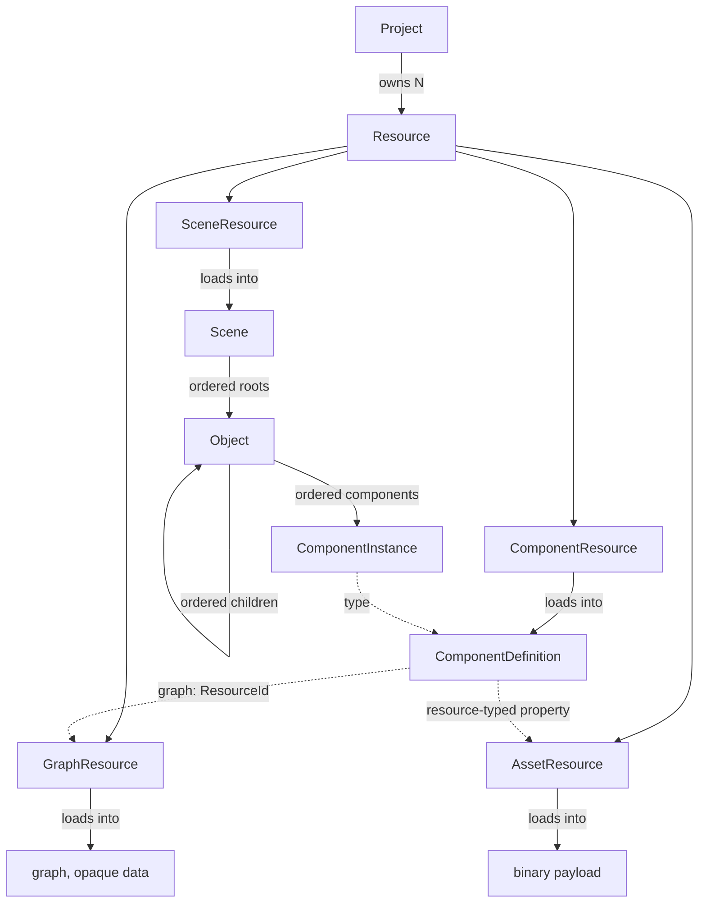
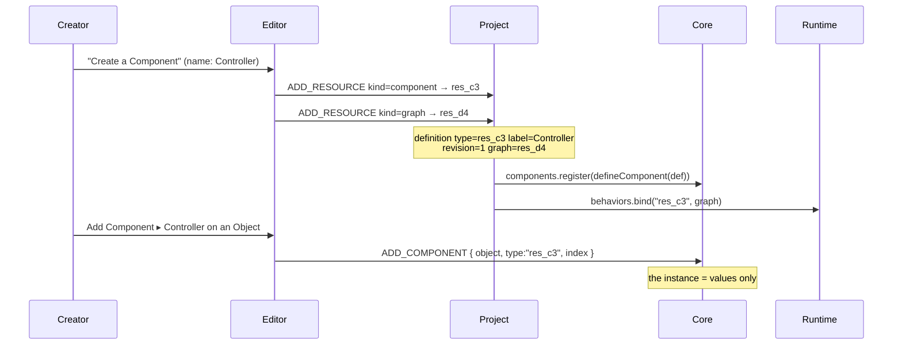

# Architectural audit — data model foundations

> **Nature:** an audit and an architecture **proposal**. This document is not a decision.
> **Date:** 2026-08-14
> **Verified against:** `HEAD = 19107304aabaeee5a29c340c3f4d81d7219de490` (`docs: move reference documentation`), aligned with `origin/master`.
> **Implementation status: NONE.** Nothing in this document is written in `src/`. No code file was created or modified.

---

## 0. How to read this document

### 0.1 Its role relative to the ADRs

**ADR = Architecture Decision Record.** The repository's ADRs (`docs/decisions/ADR-XXXX-*.md`)
record decisions that have been **made**, dated and accepted. They are authoritative.

**This document is not authoritative.** It is an audit of the real code followed by an
architecture proposal. It occupies the place that precedes an ADR: it sets out what exists,
what is missing, what is proposed, and what remains to be arbitrated. A decision adopted here
will become an ADR in its own right (§10); until it is one, it stays a proposal.

No existing ADR was modified to make its content match this proposal. Where the proposal would
change an already-written decision, that is flagged by name (§8.2, §5.4) and submitted for
arbitration.

### 0.2 Labelling of claims

`CONVENTIONS.md` requires every claim to be labelled by nature. This document uses the four
canonical labels, plus a fifth needed here:

| Label | Meaning |
|---|---|
| **OBSERVED** | verified in the repository's code, at the revision stated at the top |
| **DECIDED (ADR-XXXX)** | settled by an accepted ADR — authoritative |
| **DECISION ACCEPTED (2026-08-14)** | settled by the maintainer in the exchange that produced this document, **not yet recorded in an ADR** |
| **PROPOSAL** | a recommendation of this audit — not implemented, not decided |
| **TO ARBITRATE** | requires an explicit decision from the maintainer before any implementation |

The **DECISION ACCEPTED** label is an addition to the four in `CONVENTIONS.md`. It exists
because a decision can be taken before it is recorded; it is transitory by construction, and
disappears when the corresponding ADR is written.

### 0.3 A vocabulary warning — two "phase" numberings

Two phase breakdowns coexist in the documentation, and they are not talking about the same
thing:

| Numbering | Where | Meaning |
|---|---|---|
| **Phase 0**, then steps 1, 2, 2.8, 3, 3.5, 4… | `migration/MIGRATION_STATUS.md` | progress of the Legacy → v2 migration. **Phase 0 is closed.** The current step is 4 |
| **Phase 1, Phase 2, Phase 3** | this document | the breakdown of the "data model foundations" effort alone: audit (1), proposal (2), implementation (3) |

This document is **Phase 2 of that effort**, inside **step 4 of the migration**. The "Phase 3"
it mentions is the implementation of its own proposals, not a migration phase.

### 0.4 Method, and what it does not cover

What was done: reading the Git refs and reflog; reading `src/core`, `src/runtime`,
`src/editor`, the 17 ADRs, `ARCHITECTURE.md` and `MIGRATION_STATUS.md`; running the test suite
and the layer check on a copy of the repository; a throwaway execution probe, outside the
repository, to **measure** the behaviour of ordering and serialization instead of inferring it
from the code.

Limits, worth knowing:

| Limit | Consequence |
|---|---|
| No shell was exposed on the maintainer's machine | **`git status` could not be run.** The cleanliness of the working tree is inferred from modification dates, not verified |
| `legacy/` and `tools/parity/baseline/` were not copied | **`tools/parity/run.js` was not run.** The 39 parity scenarios are not revalidated here |

The results obtained:

```
tools/test.sh              497 tests, 497 passed, 0 failed
node tools/layers/run.js   v2 profile: 0 forbidden imports out of 325
                           legacy profile: skipped (legacy/ absent from the copy)
```

---

## 1. Decisions accepted before reading further

Four decisions were taken by the maintainer during this audit. They are not proposals and must
not be reopened here. **None is yet recorded in an ADR** (§10).

### 1.1 Component order is meaningful and persistent

**DECISION ACCEPTED (2026-08-14).** The order of an `Object`'s Components is part of the
project's persistent state. It is not a display preference. See §4.

### 1.2 Reordering is a Core mutation

**DECISION ACCEPTED (2026-08-14).** Reordering Components, children or root objects is a
structural mutation of the Core, representable as an Operation, and therefore compatible with
replication and Undo/Redo. It is not an Editor behaviour. See §6.

### 1.3 A Component definition has a stable identity distinct from its name

**DECISION ACCEPTED (2026-08-14).** Renaming a definition must not break existing instances.
See §5.2.

### 1.4 `.px` stays a JSON resource interpreted by the Runtime

**DECISION ACCEPTED (2026-08-14),** consistently with **ADR-0009**, **ADR-0015** and
**ADR-0016**: the Core does not interpret it; the graph belongs to the type/definition and is
shared by the instances; each instance keeps its own execution state. See §9.

### 1.5 Terminology: `Graph`, never `Composer`

**DECISION ACCEPTED (2026-08-14).** The visual graph editor is called **`Graph`**.

> **`Composer` is reserved** for a possible future music composition window. That term must not
> designate the graph editor anywhere — not in the UI, not in the documentation, not in code
> comments.

The distinction not to lose:

| Term | What it designates | Layer |
|---|---|---|
| **`Graph`** | the graph as a product notion, and the window that edits it | product / Editor |
| **`GraphResource`** | the **persisted resource** that carries the graph's data (§3) | Project |
| the **graph** (data) | the `{ version, nodes, connections, variables, metadata }` structure from ADR-0009 | data, transported by the Core, interpreted by the Runtime |

A `Graph` window edits a `GraphResource`, whose payload is a graph.

**OBSERVED.** The term `Composer` appears nowhere in `docs/`. It appears **once** in the code,
in a comment: `src/editor/ui/tabs.js:10` — *"Project alongside a Composer"*. **A fix for
Phase 3**: that comment must say `Graph`. It was not modified here, this step being
documentation only.

### 1.6 `Object` is not a Component, and stays an intrinsic Inspector section

**DECISION ACCEPTED (2026-08-14).** Two claims, to be held together.

**`Object` is not a Component.** It is not filed in `object.components`, it does not attach, it
does not detach, it has no Component schema. `name`, `tag`, `layer`, `active`, `visible`,
`lock` and `owner` are intrinsic properties of the `Object` (**OBSERVED**:
`src/core/object.js:46-52`, and `src/core/serialize.js:28` fixes the serialized list). That
stays consistent with **ADR-0001** and **ADR-0002**: what was moved out of the `Object` into a
Component is placement (`Transform`), not identity.

**`Object` stays an intrinsic section of the Inspector.** The creator must be able to edit the
name and the tag from the Inspector, without that turning the `Object` into a fake Component.

```
Inspector
├── Object                ← an intrinsic section, NOT a Component
│   ├── Name
│   └── Tag
├── Transform             ← a Component
│   ├── Position
│   ├── Rotation
│   └── Scale
└── …                     ← the other Components
```

**OBSERVED — this is already the repository's behaviour; this decision confirms it:**

- `src/editor/inspector/schema.js` exports `objectFields()`, a **hand-written** list (`name`,
  `tag`, `layer`, `active`), distinct from `describeComponent()`, which reads a schema or
  reflects over an instance;
- `src/editor/windows/inspector.js` renders an `Object` section **above** the Components, fed
  by `objectFields()`;
- `visible` and `lock` are deliberately absent from it: the Hierarchy row carries them, where
  they are reachable for every object at once. `id` is absent because a creator has no use for
  it.

**Compatibility with the Operations architecture.** No adaptation is needed:
`Object.setProperty()` already produces an Operation whose target is
`{ object: id, component: null }` (`src/core/object.js:160-168`). The `component: null` **is**
how the format expresses "an intrinsic property of the Object". Editing `name` from the
Inspector is therefore already a replicable, undoable mutation.

**Consequence for proposal §4.1:** moving `components` to an ordered collection does **not**
touch the `Object` section — it is not in that collection.

> **A note on reading the sketch.** In the Inspector, `Object` and `Transform` appear at the
> same visual level. That flatness of display says nothing about the model: `Transform` is a
> Component filed in `object.components`, `Object` is not.

---

## 2. What the model is today — the audit's findings

**OBSERVED.** Every claim in this section was re-verified against `HEAD`.

### 2.1 Verification table

| Finding | Location |
|---|---|
| Components are stored in a `Map`; the order is the attachment order | `core/object.js:56` |
| Children are an array; `addChild` **always** appends | `core/object.js:59`, `:297` |
| A Scene's roots are derived by filtering a `Map`'s insertion order | `core/scene.js:167-169` |
| Serialization **sorts Components alphabetically** | `core/serialize.js:151-155` |
| The Runtime runs Components **in attachment order** | `core/runtime.js:113`, `runtime/runtime.js:137-141` |
| `OperationType` contains only `SET_PROPERTY` | `core/operations/operation.js:11` |
| `Operations.register(type, handler)` exists and has **no consumer** | `core/operations/operations.js:67` |
| `seq` is a **module-level** counter, shared by the whole process | `core/operations/operation.js:14` |
| `Matrix` has **no** `decompose()` | `core/math/matrix.js` |
| The cycle prohibition lives in `addChild`, not in an Operation | `core/object.js:291` |
| `describeType()` already reads `ComponentClass.label` | `editor/registry.js:59-63` |
| `Sprite` already declares `source: { type: 'resource', default: null }` | `runtime/rendering/components/sprite.js:12` |
| `Tilemap` declares `tiles` and `palette` as `type: 'array'` | `runtime/rendering/components/tilemap.js:21-22` |
| `src/network/` and `src/project/` do not exist | — |
| `Resource` does not exist in `src/` | — |
| `Document` exists nowhere: not in code, not in an ADR, not in `ARCHITECTURE.md` | — |
| `px-tabs` is a complete primitive **with no consumer**, kept deliberately | `editor/ui/tabs.js` |

### 2.2 Correcting a claim from an earlier report

The Phase 1 audit report claimed that the `resource` type "exists nowhere". **That is false:**
`Sprite.source` has declared it since step 2.8, and `Tilemap` declares two `array` properties.
All three fall back to `READONLY` in the Inspector.

Consequence: `resource` and `array` are not hypothetical types to add for the sake of
completing a list. **Three properties of shipped components are not editable today.** And
`Sprite.source` is already a reference to a resource, in an engine that has no notion of a
resource: the `Resource` gap is not only ahead of us, it is already open behind us.

### 2.3 The central defect, measured

A probe run outside the repository against the real Core:

```
attachment order (= Runtime execution order, = Inspector order) : [ Zeta, Alpha ]
serialized key order                                            : [ Alpha, Zeta ]
after a serialize → deserialize round trip                      : [ Alpha, Zeta ]

child order                             : [ a, b ]
children after a round trip             : [ a, b ]     ← preserved
a Component's values after remove+add   : 42 → 1       ← lost
```

Two Core files contradict each other:

| File | Claim |
|---|---|
| `core/serialize.js:151` | *"component type carries no ordering meaning"* → an alphabetical sort |
| `runtime/runtime.js:113` | *"runs […] in scene insertion order"* → attachment order **is** execution order |

**The concrete consequence, today, with nothing changed: saving and reloading a project changes
the execution order of an object's Components.** Two Components where one reads what the other
writes within the same step do not behave the same before and after a save. Decision §1.1
settles this conflict in favour of meaningful order.

---

## 3. Proposal — Project / Resource, and why there is no `Document`

### 3.1 The proposed shape

**PROPOSAL.**



A solid line = ownership and serialization. A dotted line = a reference by identifier.

Two rules govern the whole diagram:

1. **Only one thing owns a piece of data.** What is owned is serialized inline; everything else
   is a reference by `ResourceId`.
2. **An identifier is never a name, never a path.** Neither for a resource, nor for a Component
   definition, nor for an Object. This is **ADR-0010** applied beyond games.

### 3.2 `Resource` — the single unit

**PROPOSAL.** `Resource` is the project's unit of identity, storage, loading and reference.
`kind ∈ { scene, component, graph, asset }`.

| | |
|---|---|
| **Identity** | an opaque `ResourceId` (`createId()`), **immutable forever**, independent of the name and the path |
| **Holds** | `id`, `kind`, `name` (displayed, editable), `path` (filing, indicative), `formatVersion`, payload |
| **Must never hold** | a reference by path; execution state; Editor state |
| **Owner** | the **Project** layer |
| **Persistence** | JSON for scene/component/graph; a binary payload outside the JSON for an asset |

```json
{
  "format": 1,
  "id": "prj_9k2m",
  "name": "My game",
  "resources": [
    { "id": "res_c3", "kind": "component", "name": "Controller", "path": "components/" },
    { "id": "res_d4", "kind": "graph",     "name": "Controller", "path": "components/" },
    { "id": "res_e5", "kind": "asset",     "name": "player.png", "path": "sprites/", "mime": "image/png" }
  ]
}
```

- `id`: identity. Never derived from the name or the path, never reused.
- `name`: display. Editable, non-unique, with no effect on references.
- `path`: filing. Moving it breaks nothing.

**Moving a project**: the paths change, the ids do not → nothing to do.
**Copying a project**: identical ids, internal coherence preserved → nothing to do.
**Importing a resource from another project**: the only conceivable collision case; the honest
treatment is a remapping pass at import time. **Not to be built now.**

This is exactly the Legacy defect `ARCHITECTURE.md` §9 notes: `id = path + name`, so renaming a
file changes its identity.

### 3.3 `Asset` — a concept evaluated and rejected

**PROPOSAL.** `Asset` does not exist as a distinct entity. An image is a `Resource` of
`kind: 'asset'` whose payload lives outside the JSON.

Making it a peer of `Resource` would create two identity schemes, two forms of reference in
properties, two loading and replication paths, and one unanswerable question: why would an
image be an `Asset` and a `.px` a `Resource`, when a property references them the same way?

The word "asset" stays an interface word — the panel may be called that — not a model concept.

### 3.4 `Document` — a concept evaluated and rejected

**PROPOSAL.** There is no `Document` in the model.

| What `Document` would bring | Who already holds it |
|---|---|
| identity | `Resource.id` |
| content | the `Resource`'s payload |
| persistence | `ResourceStore` |
| a "modified" state | derivable from the loaded resource's `Operations` pipeline |
| an undo stack | the history, **per resource**, therefore already indexable by `ResourceId` |
| view state (scroll, zoom, collapse) | **Editor state, which must never enter the project** |

`Document` would therefore be either an alias for `Resource` or a mixture of model and IDE
state. The second form is precisely the mistake `core/scene.js` documents at the top of the
file about Legacy's `scene.current`, and that **ADR-0017** turns into a rule for selection.

**What `px-tabs` opens is called an `OpenEditor`**: an Editor-layer object,
`{ resourceId, kind, viewState, history }`, never serialized into the project. Its possible
persistence ("which tabs were open") belongs to a **workspace** — a disposable artefact,
separate from the project, whose loss costs nothing.

### 3.5 `ResourceStore` — the only point of contact with storage

**PROPOSAL.** One interface, several implementations, none in the Core:

```
ResourceStore
  list()            → manifest entries
  read(id)          → payload
  write(id, data)   → persists
  delete(id)
```

| Backend | When | What it changes |
|---|---|---|
| memory | tests, startup | nothing |
| IndexedDB | local / offline mode (`Store` already written and unused, `ARCHITECTURE.md` §9) | the implementation alone |
| HTTP / remote | later | the implementation alone, plus a cache policy |

**Lazy loading, by id**: opening a project reads the manifest, not the payloads. Binary
payloads are **never** base64 inside a scene's JSON — which fixes the defect noted by
`ARCHITECTURE.md` §9, and keeps a replicated scene snapshot from carrying images.

### 3.6 A new `src/project/` layer

**PROPOSAL.**

```
editor/  ──►  project/  ──►  core/
runtime/ ──►  core/
core/    ──►  (nothing)
```

`project/` imports neither the DOM, nor `runtime/`, nor `editor/`. A headless server must be
able to load a project — which is what **ADR-0011** requires (the authoritative server loads
the same definitions and the same scenes as the client).

**Rejected alternative:** putting loading in `editor/`. A server cannot depend on an IDE.

**Tooling impact:** `tools/layers/rules.js` will have to declare the `project` layer and the
prohibitions `project → editor`, `project → runtime`, `core → project`. Otherwise the layer
check would let an inversion through.

---

## 4. Proposal — ordered collections

### 4.1 The shape of the storage

**PROPOSAL.** The problem measured in §2.3 is not a missing API, it is the **shape of the
container**. A `Map` serialized as a sorted JSON object cannot carry an order.

`components` becomes an **ordered collection, serialized as an array**:

```json
"components": [
  { "type": "Transform",         "values": { "x": 0, "y": 40 } },
  { "type": "res_c3",            "values": { "speed": 120 } },
  { "type": "RectangleRenderer", "values": { "width": 64 } }
]
```

Why an array rather than an `order` field inside an object:

- an array **is** ordered; an `order` field is an ordering you have to keep consistent,
  validate, and repair when it is not;
- there is no longer a sort to remove in `serialize.js`: there is nothing left to sort;
- two serializations of the same model stay identical byte for byte — which is what the sort
  was trying to guarantee, and which an array achieves without destroying the information.

The same reasoning applies to the roots: **the Scene holds an ordered list of roots**,
serialized as `roots: [id, id, …]`, exactly as `children` already is for an `Object`.
`roots()` returns it instead of filtering.

**`FORMAT_VERSION` goes from 1 to 2.** No data migration to write: there is no v1 project
(**ADR / Q6**, `ARCHITECTURE.md` §10).

### 4.2 What order means, now explicitly

**PROPOSAL.** Once this work is done, one sentence, written in one place:

> The order of an `Object`'s Components is the order in which the Runtime runs their `update`,
> and the order in which the Inspector displays them. It is the same order. It is persistent.

That resolves the contradiction in §2.3 **from above**: `serialize.js` stops claiming that
order has no meaning, because it has one.

**Draw** order stays governed by `layer` and then by scene order
(`SceneRenderer.#drawOrder`, a stable sort) — unchanged, and deliberately distinct from
`update` order.

---

## 5. Proposal — user Components

### 5.1 The full cycle



### 5.2 A stable identity vs a displayed name

**PROPOSAL**, implementing **DECISION ACCEPTED §1.3**.

> The `type` field becomes the stable identity, never editable by the creator.
> The `label` field becomes the displayed name, freely editable.

| | A native Component | A user Component |
|---|---|---|
| `static type` | `'Transform'` — fixed in the code | `'res_c3'` — the `ResourceId` of its definition |
| `static label` | `'Transform'` (implicit) | `'Controller'` — editable |

Three reasons this choice costs almost nothing:

1. **The seam already exists.** `editor/registry.js:59-63` reads
   `ComponentClass?.label ?? shipped?.label ?? type`.
2. **The registry and serialization keep working identically**: they key by `type`, which stays
   an opaque string.
3. **Renaming becomes a `SET_PROPERTY` on the definition's `label`.** No instance is touched,
   no scene rewritten, no project broken.

**An accepted asymmetry** — a readable `type` for a native component, an opaque one for a user
component: a native component's name is code, and therefore stable by nature; a user
component's is data, and therefore unstable by nature. **→ Arbitration point 4 (§11).**

### 5.3 The shape of a definition

**PROPOSAL.**

```json
{
  "format": 1,
  "type": "res_c3",
  "label": "Controller",
  "revision": 3,
  "icon": "component",
  "category": "Gameplay",
  "properties": {
    "speed":  { "type": "number",   "default": 120, "min": 0 },
    "target": { "type": "resource", "kind": "scene", "default": null }
  },
  "graph": "res_d4"
}
```

`icon` and `category` are already honoured by `editor/registry.js` through
`ComponentClass.category` — so they are free.

### 5.4 The graph referenced by id — a flagged divergence from ADR-0016

**PROPOSAL — TO ARBITRATE.** **ADR-0016** shows, in its JSON example, the graph **inline**
inside the definition: `"graph": { "version": 1, "nodes": [], … }`. The proposal is that the
definition reference its graph **by `ResourceId`**: `"graph": "res_d4"`.

This is not a contradiction of ADR-0016's reasoning — its §5 establishes that "for the Core, a
graph is data", and its table of open points explicitly leaves "the file format and storage of
a definition (a resource)" unresolved. But the written example shows the other form, and **this
therefore needs explicit agreement.**

Arguments for the reference: an inline graph would make it impossible to open `Controller.px`
in a `Graph` window without also opening the definition file, and would let two copies of the
same graph diverge.

**→ Arbitration point 1 (§11).**

### 5.5 A definition evolving, and the fate of the instances

**PROPOSAL.** Three strategies evaluated:

| | **S1 — Structural reconciliation** ★ | **S2 — Versions + migrations** | **S3 — Nothing** |
|---|---|---|---|
| Principle | at load time, the stored values are filtered by the current schema: unknown keys dropped, missing keys filled with the default | each definition carries a version; the instance stores its own; migration scripts move instances up | instances keep what they have |
| Adding a property | the default is applied ✅ | ✅ | absent ❌ |
| Removing a property | the value is dropped ✅ | ✅ | a phantom value serialized ❌ |
| Renaming a property | loses the value | possible | loses the value |
| Complexity | **very low** | high | none, but incorrect |
| Network determinism | total | depends on the scripts | poor |

**Recommendation: S1.** **ADR-0016** §4 already establishes that "a fresh instance has exactly
the declared properties" and that "the schema of a defined component is necessarily
exhaustive". S1 is merely that rule applied **at load time** and not only at construction.

The only case not covered is **renaming a property**. The honest remedy, the day the need
arises, is a data field on the descriptor (`previousNames: [...]`) read by the reconciliation.
**Not to be built now.**

`revision` serves two purposes and only two: telling `Behaviors` that a graph has changed, and
telling the Editor that a panel must be rebuilt. **Instances do not store a `revision`** —
which is what keeps S1 simple.

### 5.6 Deleting a definition that is still in use

**PROPOSAL.** The current behaviour would be a `throw` from `registry.create()` at load time,
and a whole scene lost.

Proposal: deserializing a Component of an unknown type **does not throw**; it produces a
`MissingComponent` that keeps its serialized values, its type and its index in full, does not
run, and reports itself in the Inspector.

Losing a scene because a file is missing is the worst possible behaviour for an editor. A
placeholder that preserves the data lets you restore the definition and find the project
intact.

**A point deliberately left open:** should an authoritative server, for its part, **refuse** to
load an incomplete scene? That is a server policy decision, outside this audit's scope.

---

## 6. Proposal — hierarchy, reordering, reparenting

### 6.1 A unified `REPARENT`

**PROPOSAL**, implementing **DECISION ACCEPTED §1.2**.

`UNPARENT` must not be a separate Operation: `REPARENT` with `parent: null` covers it exactly.
Reasons: its inverse is a `REPARENT` (two operations that invert each other are the same
operation); `Object.addChild()` already detaches from the previous parent, so "adding a child"
*is* a reparent; two operations for one mutation means two inversion rules, two cycle
validations, two replication paths.

And, the most structural point of the proposal:

> **`REPARENT` also carries the index.** It then covers: reparenting, detaching, reordering
> among siblings, and reordering among the roots.

The real gesture in a Hierarchy is a drop *between two rows* — it changes the parent **and** the
position, atomically. Separating them would produce two operations that must always travel
together, undo together, and whose order matters.

By symmetry: **a Scene's roots are the children of an implicit `null` parent.** Reordering a
root is `REPARENT { parent: null, index }`. One mental model, one operation, one inverse.

### 6.2 The Core primitives

**PROPOSAL.**

| Primitive | Scope | Why this shape |
|---|---|---|
| `object.moveComponent(component, index)` | Object | A Component does not change owner, only rank |
| `scene.reparent(object, parent, index)` | Scene | **Replaces `moveChild` and `moveRoot`.** Reordering among siblings = reparenting to the same parent at another index; reordering a root = reparenting to `null` |

Why `reparent` is carried by the **Scene** and not by the `Object`: reordering a root has no
owning `Object` — the Scene owns the list; a reparent touches **two** parents, and making one
of the two carry it is arbitrary; and the Scene already owns the `Operations` pipeline and is
the identity resolver.

`addChild` / `removeChild` stay, unchanged, as shortcuts preserving the local transform — which
is what a script expects and what `editor/project/starter.js` uses.

### 6.3 Cycles

**PROPOSAL.** The guard already exists (`core/object.js:291`, `isAncestorOf`) but it lives in
`addChild`. It must be carried by the **`REPARENT` Operation's handler**, for three reasons:

1. a **replicated** operation goes through `apply()` and must be validated too;
2. an invalid operation must produce `applied: false`, **not a `throw`** — a `throw` inside
   `#applyNow` would propagate to the transport;
3. the authority (**ADR-0011**) must be able to refuse upstream, not merely observe downstream.

**A cycle over the network:** two clients simultaneously reparent A under B and B under A. Each
operation is valid locally; their composition is not. It is the authoritative server that
decides: it arbitrates in **its** order and rejects the second. That is exactly what
**ADR-0011** exists for, and it requires no extra machinery.

### 6.4 Transform on reparenting — the question, and the answer

**PROPOSAL.**

```
Scene                      Scene
└── Player          →      ├── Player
    └── Sword               └── Enemy
                                └── Sword
```

- **A — keep the local Transform**: the stored values do not move. The sword visually jumps to
  wherever the new parent places it.
- **B — keep the world Transform**: the local values are recomputed so that the sword does not
  move on screen.

**Recommendation: B, world preservation by default — but composed in the Editor, never built
into the Core.**

```
A gesture in the Hierarchy  =  batch {
                                 REPARENT      { object, parent, index, previous… }
                                 SET_PROPERTY  x
                                 SET_PROPERTY  y
                                 SET_PROPERTY  rotation
                                 SET_PROPERTY  scaleX
                                 SET_PROPERTY  scaleY
                               }
```

Five reasons, all verifiable in the current code:

1. **`REPARENT` stays invertible by its structure alone.** A `REPARENT` that recomputed the
   Transform would also have to carry the five previous values to be undoable — it would carry
   two mutations under one name.
2. **Replication stays exact.** The recomputed values travel as numbers. If each node
   recomputed its own decomposition, two machines would diverge on floats. That is the kind of
   desynchronization you never diagnose.
3. **`batch` already exists** (`core/operations/operation.js`, **ADR-0008**) and does exactly
   this: "one drag = one history entry". One undo entry, six operations.
4. **The Core keeps one law.** `parent.addChild(child)` from a script preserves the local
   transform — which is what code expects. World preservation is an **editor policy**, written
   in `editor/commands.js`, already declared as the insertion point for structural Operations.
5. **ADR-0002 is honoured**: values stay local, the world stays derived, nothing is stored
   twice.

Why B rather than A as the default: in Unity, Godot and Blender, dragging an object in the
hierarchy does not move it. A creator tidying their tree is tidying, not moving.

A is not abandoned for all that: it is what `addChild()` does from a script, and one day a
"keep the local position" checkbox in the Editor.

### 6.5 `Matrix.decompose()` and the shear problem

**OBSERVED.** `Matrix` has no `decompose()`. **PROPOSAL:** add it — pure, testable under Node,
with no dependency.

`Matrix.compose` produces T·R·S:

```
| cos·sx   -sin·sy   x |
| sin·sx    cos·sy   y |
```

The inverse decomposition is direct:

```
x, y     = e, f
scaleX   = hypot(a, b)
rotation = atan2(b, a)
scaleY   = hypot(c, d)
```

> **It is exact if and only if the two columns are orthogonal.** They stop being so as soon as
> an ancestor carries a **non-uniform** scale *and* an intermediate node is **rotated**: the
> composition then produces a **shear**, which `(x, y, rotation, scaleX, scaleY)` cannot
> represent.

This is the same problem as Unity's `lossyScale`, and it has no clean solution in a local
five-value model.

**Proposed policy for that case:** decompose as best as possible (an orthogonal fit) **and say
so** to the creator through the reporting channel, in the spirit of **ADR-0012**: the system
does not silently correct, it says what it could not do. Reparenting under a shearing parent is
rare; making it silently distorting would be worse than making it noisy.

**Rejected alternatives:** forbidding non-uniform scale on a parent (too restrictive for a 2D
engine where stretching scenery is common); storing world matrices (contradicts **ADR-0002**
and `core/components/transform.js`, and reintroduces two sources of truth).

**A point deliberately left open:** the exact fallback policy for a sheared matrix (an
orthogonal fit? keeping the local transform? refusing the gesture?) remains to be decided at
implementation time.

### 6.6 Consequences of reparenting, by domain

| Domain | Effect |
|---|---|
| Matrices | `Matrix.decompose()` added |
| Position / Rotation / Scale | recomputed, exact outside shear |
| Serialization | **no change** — these are ordinary local values |
| Undo/Redo | a single `batch` inverts the six operations, in reverse order |
| Replication | numbers travel, no remote recomputation, no divergence |

---

## 7. Proposal — the Operations

### 7.1 The minimal set

**PROPOSAL.** Seven types for the Scene, two for the Project.

| Type | Exists | Scope | Payload | Inverse |
|---|---|---|---|---|
| `SET_PROPERTY` | ✅ | Scene | `{ target, prop, value, previous }` | `previous` ↔ `value` |
| `ADD_OBJECT` | to create | Scene | `{ object: <serialized, id included>, parent, index }` | `REMOVE_OBJECT` |
| `REMOVE_OBJECT` | to create | Scene | `{ object, subtree, parent, index }` | `ADD_OBJECT` of the subtree at its position |
| `ADD_COMPONENT` | to create | Scene | `{ object, type, index, values }` | `REMOVE_COMPONENT` with the same `index`/`values` |
| `REMOVE_COMPONENT` | to create | Scene | `{ object, type, index, values }` | `ADD_COMPONENT` with the same `index`/`values` |
| `REPARENT` | to create | Scene | `{ object, parent, index, previousParent, previousIndex }` | the same, `previous*` swapped |
| `MOVE_COMPONENT` | to create | Scene | `{ object, type, index, previousIndex }` | the same, indices swapped |
| `ADD_RESOURCE` / `REMOVE_RESOURCE` | to create | **Project** | manifest + payload | each other |

Details that make the difference between an operation and a correct operation:

- **`REMOVE_OBJECT.subtree` and `index`**: without them, undoing a deletion gives back a
  stripped object, placed at the end of the list.
- **`REMOVE_COMPONENT.values`**: fixes exactly the `42 → 1` measured in §2.3.
- **`MOVE_COMPONENT` detaches nothing**, re-instantiates nothing, touches no value. It is a
  `splice` on the ordered collection.
- **A no-op `REPARENT`**: `parent === previousParent && index === previousIndex` →
  `applied: false`, no Operation emitted. The same guard `setProperty` has today.
- **Creating a child** is the **same** `ADD_OBJECT` with `parent ≠ null`. No extra operation.

### 7.2 A flagged divergence from ADR-0008

**PROPOSAL — TO ARBITRATE.** **ADR-0008** and `ARCHITECTURE.md` §6.2 list `ADD_CHILD` and
`REMOVE_CHILD`, and no reordering operation. The proposal merges them into `REPARENT`.

This is **not** a reversal of a decision: ADR-0008's list is an inventory derived from Legacy's
network messages, and the capability covered is rigorously identical. But it is a
simplification of a list written in an accepted ADR, **and it therefore needs explicit
agreement.** ADR-0008 was not modified.

**→ Arbitration point 2 (§11).**

### 7.3 `submit()` / `apply()` and the absence of echo

**OBSERVED — nothing to change.** The existing design is correct and sufficient.

| | `submit(op)` | `apply(op)` |
|---|---|---|
| Authority (**ADR-0011**) | yes | no |
| Applies | if authorized | yes |
| Emits `'operation'` | yes | **no** |
| Who uses it | the author of an intent (Editor, player, the server arbitrating) | a node receiving an already-authoritative operation |

The anti-echo holds because applying emits nothing, and because applying performs a direct
write that produces no Operation (`core/operations/operations.js:15-17`). **The loop is not
prevented, it is unrepresentable.**

The new types change none of that, **on one condition**: their handlers must mutate the model
through the internal path, never by calling back a public API that would resubmit.

`Operations.register(type, handler)` already exists and has no consumer: that is exactly the
intended seam. Scene and Object register their handlers; the pipeline stays ignorant of the
model.

### 7.4 A second pipeline, not a second system

**PROPOSAL.** Resource mutations are not Scene mutations: a Scene pipeline's `resolve` resolves
`Object` ids, and cannot resolve a resource.

A **second `Operations` pipeline at Project scope**. The same class, the same contract, the
same anti-echo, a different `resolve`. It is not a parallel system — it is the same machine
instantiated twice, exactly as a detached `Object` already instantiates its own pipeline
(`core/object.js:90`).

### 7.5 Payload: what travels, what stays

**PROPOSAL.**

| Field | Needed to **apply** | Needed to **invert** |
|---|---|---|
| `SET_PROPERTY.previous` | no | **yes** |
| `REMOVE_OBJECT.subtree` | no | **yes** |
| `REMOVE_COMPONENT.values` | no | **yes** |
| `REPARENT.previous*` | no | **yes** |

**ADR-0008** already notes the "heavier payload" as a negative consequence. The inversion
fields are part of the Operation, and **a transport is free to prune them**: a server does not
need `previous` in order to apply; the local history keeps the complete operation. That is a
transport optimization **not to be built now**, but the format must make it possible — and it
does, as soon as the inversion fields are named and separable.

### 7.6 Identity and `seq`

**PROPOSAL.** Two rules without which replication cannot work:

1. **Identifiers are generated by the author** and travel in the payload. Never by the
   receiver, or the ids diverge from one machine to another.
2. **`seq` must become per-pipeline.** **OBSERVED**: it is today a module-level counter
   (`core/operations/operation.js:14`), shared by every scene in the process. Harmless as long
   as it is only a local ordering number; wrong the day it becomes a network sequence number or
   a history ordering key.

### 7.7 Batching

**OBSERVED.** `batch` exists and is sufficient. Three uses, all covered:

- a drag in the viewport → n `SET_PROPERTY`s, one `batch`;
- a drop in the Hierarchy → `REPARENT` + 5 `SET_PROPERTY`s, one `batch`;
- creating a user Component → `ADD_RESOURCE` × 2, one `batch` (the Project pipeline).

---

## 8. Proposal — Undo / Redo

### 8.1 The division of responsibility

**PROPOSAL.**

| What | Where | Why |
|---|---|---|
| An Operation carries what it needs to invert | **Core** — the format | already the case for `SET_PROPERTY` (`previous`) |
| `invert(operation) → operation` | **Core** | one place knows each type's inversion rule; pure, testable under Node; stops the Editor from re-deriving those rules |
| The stack, the grouping, the shortcut | **Editor** | undoing is an authoring act. A headless server replaying operations undoes nothing |

This is **ADR-0008** ("undo/redo becomes a consequence of the architecture, not a separate
feature") made concrete: the Core makes things invertible, the Editor decides what to undo.

### 8.2 The history

```
Operations.on('operation')  ──►  History  ──►  undo() ──► operations.submit(invert(op))
```

Four rules, and they are enough:

1. **We record what `submit()` emitted** — therefore never an operation received through
   `apply()`. The anti-echo protects the history for free.
2. **We record only our own operations** (`actor === me`). Without that rule, `Ctrl Z` would
   undo another creator's work. No machinery needed: the `actor` field already exists.
3. **Undoing goes through `submit()`, never through `apply()`.** An undo is a new intent: it
   must be arbitrated (the server may refuse it) and it must replicate. An undo applied locally
   would silently desynchronize the project. *This is the easiest point in the whole system to
   get wrong.*
4. **A `batch` is one entry.** Inverted in reverse order.

The "redo" stack is the stack of undone operations, cleared as soon as a new operation is
submitted.

### 8.3 Scope: one stack per resource

**PROPOSAL.** A global stack is a classic mistake: `Ctrl Z` in the `Graph` window would undo a
change made in the scene.

| Stack | On which pipeline | What it undoes |
|---|---|---|
| Project | the Project pipeline | creating / deleting / renaming a resource |
| Scene (one per open scene) | that Scene's pipeline | all of §6 |
| Graph (one per open graph) | that graph's pipeline | graph editing, once its model exists |

### 8.4 What is not restored, and must be said

A graph's execution state (the `Behaviors` `WeakMap`) and a Component's working fields are
**not** restored. They are live state, not project data; undoing does not rewind the
simulation. It is the same boundary as between a direct write and a `setProperty`
(**ADR-0003**), and it needs to be stated rather than discovered.

### 8.5 No parallel system

The history **never mutates the model directly**. It has one action: `submit(invert(op))`.
There is therefore no second mutation path, and nothing is undoable that is not replicable.

---

## 9. Proposal — the `.px` graph, the `Graph` window, and `px-tabs`

No ADR decision is reopened here: **ADR-0009** (`.px` is an interpreted JSON graph, no `eval`,
no `new Function`), **ADR-0015** (a graph is the behaviour of a **type**) and **ADR-0016** (a
definition is properties + a graph) all hold in full. This section only fills the gaps those
ADRs explicitly left open.

### 9.1 What the proposal adds

| Gap | Proposal |
|---|---|
| **Storage** | one `GraphResource` per graph. JSON, payload = the shape from ADR-0009 |
| **Identity** | its resource's `ResourceId`. Renaming breaks nothing |
| **Version** | the graph format's `version` (already in ADR-0009) + the resource's `revision`, for invalidation |
| **Reference from a definition** | `definition.graph = "res_d4"` — an id (§5.4, to arbitrate) |
| **Loading / saving** | through the `ResourceStore` (§3.5) |
| **Binding** | **the Project layer calls `behaviors.bind(type, graph)`** when the project is opened, and at every `revision` of the graph. That is the answer to the "who calls `bind()`" open point left by **ADR-0009**, **ADR-0015** *and* **ADR-0016** |
| **Relation to Resource** | a graph **is** a resource, like a scene or an image |
| **Relation to the `Graph` window** | the window edits a `GraphResource` through an `Operations` pipeline, so undo and replication come for free |
| **Graph vs execution state** | unchanged, **ADR-0015** §3 and §4: the graph belongs to the type, the execution state lives in the `Behaviors` `WeakMap`, one per instance. **Nothing in this proposal touches it** |

### 9.2 What stays open, where the ADRs left it

1. **the node and connection model** — **ADR-0009**;
2. **the fate of a graph's `variables` with respect to the Component's schema** — open in
   **ADR-0009** *and* **ADR-0015**;
3. **whether graph mutations deserve their own Operation types** (`ADD_NODE`, `CONNECT`…). The
   architecture allows it (`Operations.register`) and does not depend on it: as long as the
   graph model does not exist, a graph is saved whole. **A deliberate deferral, not an
   oversight.**

### 9.3 `px-tabs` — the contracts, and nothing more

**OBSERVED.** `px-tabs` is a complete primitive, with no consumer, kept deliberately. Its file
already documents what must **not** be built: a document lifecycle, closeable tabs, overflow,
drag to reorder, detachment.

**PROPOSAL.** What this architecture gives it is the only thing it was missing: knowing what a
tab designates.

| Question | Answer |
|---|---|
| What is an open tab? | an **`OpenEditor`** — an Editor-layer object: `{ resourceId, kind, viewState, history }` |
| Is it a `Resource`? | **no** — it is a *live view* onto a `Resource` |
| Is it a `Document`? | **no** — `Document` does not exist (§3.4) |
| Several scenes / graphs open? | N `OpenEditor`s, at most one per `resourceId` |
| How is a change persisted? | through the `ResourceStore`, on the resource identified by `resourceId` |
| How do you know it is modified? | a `dirty` flag raised by the resource pipeline's `'operation'` event, lowered on save. One source, no content comparison |
| Undo across several documents? | one stack per resource (§8.3) |

**Nothing to build in `px-tabs` now.**

### 9.4 An ambiguity flagged rather than invented

**An action that touches two resources at once has no obvious undo scope.**

Example: "Create a Component" creates a `ComponentResource` *and* a `GraphResource`. That is a
`batch` on the Project pipeline, so one entry in the Project stack — coherent. But if the
creator then edits the graph, undoes three times in the `Graph` window, and then undoes once in
the Project panel: the component's creation is undone while changes to its graph are still in a
stack pointing at a resource that no longer exists.

Possible solutions — **none is adopted here**:

- closing a tab clears its stack (simple, a little brutal);
- deleting a resource invalidates the history entries that target it (correct, requires a
  pass);
- forbidding the undo of a resource deletion from another stack (restrictive).

This is the one point in this document where inventing would be a mistake. **It does not block
Phase 3**: it becomes decidable once the `Graph` window exists.

---

## 10. The property-type vocabulary

### 10.1 The divergence, measured

**OBSERVED.**

| `core/definition.js` — `DEFAULTS` | `editor/inspector/schema.js` — `FieldKind` | **ADR-0007** (contemplated) |
|---|---|---|
| number, int, boolean, string, color, array, object | number, int, **range**, boolean, string, color, **enum**, **readonly** | number, int, boolean, string, color, enum, range, vector2, resource, object, array, action |

And in the shipped code: `Sprite.source` = `resource`, `Tilemap.tiles`/`palette` = `array`,
`Transform.rotation` = `number` + `unit: 'rad'`, `ParticleSystem` = `unit: 's'` and `'/s'`.

### 10.2 The cause, and the proposed solution

**PROPOSAL.** The divergence is not an oversight: **two different questions are being asked
with one word.**

- *"what shape does this value have?"* → default, validation, serialization, replication → **a
  Core question**;
- *"with what control should it be edited?"* → slider, checkbox, picker → **an Editor
  question**.

`range` proves it: it is not a shape of value, it is a `number` bounded at both ends, and
`schema.js` already derives it correctly without any component declaring it. `readonly` too: it
is a display fallback, not a data type.

> **Two vocabularies, one source: the Core owns `PropertyType`, the Editor derives `FieldKind`
> from it.**

### 10.3 `PropertyType` — eight members, each justified

**PROPOSAL.**

| Type | Justification | Default |
|---|---|---|
| `number` | ubiquitous | `0` |
| `int` | `layer`, `columns`, `rows` | `0` |
| `boolean` | `active`, `emitting`, `additive` | `false` |
| `string` | `name`, `tag` | `''` |
| `color` | `ParticleSystem.color`, `RectangleRenderer` | `''` |
| `enum` | **already rendered by the Inspector, with no Core default today** — that is where the inconsistency is | the first value |
| `resource` | **`Sprite.source` already declares it**; indispensable for `.px` and for user Components | `null` |
| `array` | **`Tilemap.tiles` and `palette` already declare it** | `[]` |

For each descriptor, the Core answers: what the starting value is, whether that value is valid,
and how it serializes.

### 10.4 Rejected, and why

| Type | Verdict |
|---|---|
| `object` | **removed from `DEFAULTS`.** No schema, no validation, no editor, no meaning for replication. It is the only current member nothing justifies. **This is a removal → arbitration point 3 (§11)** |
| `vector2` | unnecessary — the Inspector's `PAIRS` table already puts `x`/`y` on a single row |
| `action` | it is not a property. A button is a command, not serializable data. Its place is a future command registry (already listed as open in `MIGRATION_STATUS.md` for `Ctrl K`) |
| `range` | derived from `number + min + max`, not declared |

**What this concretely closes:** three properties of shipped components stop being dead ends; a
user Component can no longer declare a property the Core initializes wrongly. `array` **stays
`READONLY` with its element count** — honest, already in place (`describeOpaque`), and not to
be improved now.

**No type is added to complete a list:** two are already declared in the code, one is already
rendered, one is removed.

---

## 11. The five arbitration points

**TO ARBITRATE.** These five points are **still open** as of 2026-08-14. None has been settled.
The first three **block** Phase 3.

| # | Point | Reference |
|---|---|---|
| **1** | **Is a definition's graph referenced by `ResourceId`, or inline as ADR-0016's JSON example shows?** — recommendation: by id | §5.4 |
| **2** | **Do `ADD_CHILD` / `REMOVE_CHILD` merge into `REPARENT`?** This is a simplification of a list written in **ADR-0008** and `ARCHITECTURE.md` §6.2 | §7.2 |
| **3** | **Is the `object` type removed from `DEFAULTS`?** This is a removal, not an addition | §10.4 |
| **4** | **Is the asymmetry — a readable `type` for a native Component, opaque for a user Component — accepted?** | §5.2 |
| **5** | **Q8 — should the Inspector present a single `Renderer [ Type ▼ ]`?** Open since 2026-08-13 (`MIGRATION_STATUS.md`). It now **interacts with Component order**: a single type selector would imply a removal plus an addition, and therefore a change of rank **on top of** a loss of values. §4 makes that cost more visible than before | §4, `MIGRATION_STATUS.md` |

### Points deliberately left open (distinct from the arbitrations)

These require no decision now and block nothing:

1. **the undo scope of a cross-resource action** (§9.4);
2. **server policy for a missing definition** (§5.6);
3. **the granularity of graph Operations** (§9.2);
4. **the fallback policy for a sheared matrix** (§6.5);
5. **the graph model and its interpreter** — **ADR-0009**, out of scope;
6. **the fate of a graph's `variables`** — **ADR-0009** and **ADR-0015**, out of scope.

---

## 12. ADRs to create — not to be written without arbitration

**No ADR was created for this proposal, and none must be before arbitration.** The table below
identifies the decisions that, **if adopted**, deserve an ADR of their own. The numbering is
**indicative**: it will depend on the real order of acceptance.

| Provisional | Subject | Depends on |
|---|---|---|
| ADR-0018 | Meaningful, persistent structural order: ordered collections, `components` as an array, ordered `roots`, `FORMAT_VERSION` 2 | §1.1, §4 |
| ADR-0019 | Structural Operations, `invert()`, and a unified `REPARENT` | §6.1, §7 — **blocked by arbitration 2** |
| ADR-0020 | `Resource` / `ResourceId` / `ResourceStore`; neither `Document` nor `Asset`; the `src/project/` layer | §3 |
| ADR-0021 | A Component definition's identity: a stable `type`, a displayed `label` | §5.2 — **blocked by arbitration 4** |
| ADR-0022 | Transform policy on reparenting: the world preserved, composed in the Editor | §6.4, §6.5 |
| ADR-0023 | The property-type vocabulary: `PropertyType` (Core) / `FieldKind` (Editor) | §10 — **blocked by arbitration 3** |
| ADR-0024 | Undo/Redo: `invert()` in the Core, `History` in the Editor, one stack per resource | §8 |

Decisions **§1.5** (the `Graph` terminology) and **§1.6** (`Object` as an intrinsic Inspector
section, `Object` is not a Component) probably do not need an ADR:

- terminology is a matter of **product vocabulary**, for which `PROJECT.md` §2 is the natural
  place;
- the nature of the `Object` **confirms already-implemented behaviour** and the direction
  already taken by **ADR-0001**, **ADR-0002** and **ADR-0007**; there is no new decision to
  record, only a rule not to break.

---

## 13. Architectural boundaries

**PROPOSAL.**

| Responsibility | Core | Runtime | Editor | Project/Storage |
|---|---|---|---|---|
| **Object** — structure, order, identity, `name`/`tag` | **owns** | reads | reads, mutates through Operations | serializes through the Core |
| **Scene** — objects, ordered roots, pipeline | **owns** | reads, runs | reads, mutates through Operations | loads / saves |
| **Component Definition** — shape, `defineComponent` | **owns the shape** | reads `graph` through `Behaviors` | edits through Operations | **owns the storage** |
| **Component Instance** — values | **owns** | reads, runs | displays, mutates through Operations | serializes through the Core |
| **Resource** — id, kind, payload | — | — | consumes | **owns** |
| **`.px`** — the graph | transports it, **never interprets it** | **interprets** | edits (the `Graph` window) | **stores** |
| **Operations** — format, pipeline, `invert()` | **owns** | — | emits | emits (project scope) |
| **Undo/Redo** — stack, shortcuts | provides `invert()` | — | **owns** | — |
| **Serialization** — Scene / Object / Component | **owns** | — | — | calls |
| **Serialization** — manifest, resources | — | — | — | **owns** |
| **Loading** | — | — | triggers | **owns** |
| **UI** | — | — | **owns** | — |
| **Selection, viewState, tabs** | — | — | **owns** (**ADR-0017**) | — |

### 13.1 Does the Editor stay a consumer?

**OBSERVED**: yes, today. The Hierarchy reads `scene.roots()` and `object.children`; the
Inspector reads `object.components` and then `componentSchema()` or reflection; selection is
Editor state; the layer check passes. Where the Editor met a missing Core capability, it
**refused to work around it** and wrote it down (`editor/windows/inspector.js:99`).

**PROPOSAL** — the proposal keeps it that way, and that is verifiable by three tests:

1. **No parallel collection.** Reordering reads `object.children` and `object.components` and
   mutates through an Operation. No display list.
2. **No duplicated business rule.** The cycle prohibition, index clamping and schema validation
   are in the Core. The Editor may disable a drop visually; the Core remains the sole judge.
3. **The only thing the Editor decides alone** is the *policy* of world preservation on
   reparenting (§6.4) — and it expresses it in Core Operations, not in direct writes.

---

## 14. Recommendation, and proposed implementation order

### 14.1 The recommendation, in nine points

**PROPOSAL.**

1. **A new `src/project/` layer**, between the Core and the Editor, owner of the manifest, of
   the `ResourceId`s and of the `ResourceStore`.
2. **`Resource` is the single unit of identity, storage and reference.** No `Document`, no
   `Asset`.
3. **`px-tabs` opens `OpenEditor`s** — `{ resourceId, kind, viewState, history }`, on the
   Editor side, never persisted into the project.
4. **Ordered collections become arrays:** `components` as an array of `{ type, values }`,
   `roots` as an ordered list of ids. `FORMAT_VERSION` → 2.
5. **`type` is the identity, `label` is the name.** For a user Component, `type` is its
   `ResourceId`.
6. **Seven Operation types**, including a single `REPARENT { object, parent, index }` covering
   reparenting, detaching, reordering among siblings and reordering the roots.
7. **`REPARENT` never touches the Transform.** World preservation is an Editor policy,
   expressed as a `batch` of `REPARENT` + five `SET_PROPERTY`s.
8. **The Core provides `invert()`, the Editor owns the history**, one stack per resource,
   `submit()` to undo, never `apply()`.
9. **Two type vocabularies:** `PropertyType` in the Core, `FieldKind` derived in the Editor.

### 14.2 Why this one

**Because it creates no concept the code is not asking for.** `Document` was evaluated and
rejected; `Asset` was evaluated and rejected; definition migrations were evaluated and replaced
by a structural reconciliation.

**Because it closes gaps that are already open, not only future ones.** `Sprite.source` has
been declared `resource` since step 2.8 with no resource to reference; `Tilemap` has two
non-editable properties; the runtime-order / serialized-order contradiction changes the
behaviour of a reloaded project.

**Because it leaves the Core small.** The Core only gains: ordered collections, six Operation
types, `invert()`, `PropertyType`, `Matrix.decompose()`. It gains no resource, no loading, no
history, no interpreter. It still depends on nothing.

**Because it is consistent with what is already written:** `Operations.register()` was waiting
for its consumers; `batch` was waiting for a composed gesture; `previous` was waiting for a
history; `describeType()` already read a `label`; `px-tabs` was waiting to know what a tab
designates; **ADR-0016** left open both a definition's storage and the caller of `bind()`.

**Because it makes the network possible without building it.** Ids generated by the author,
invertible operations, arbitration through `submit()`, prunable inversion fields, `seq` per
pipeline. That is exactly **ADR-0008**'s mandate.

### 14.3 A proposed implementation order for Phase 3

**PROPOSAL.** Each step is useful on its own and leaves the repository green.

| # | Contents | Why here |
|---|---|---|
| 1 | Ordered collections + `FORMAT_VERSION` 2 + `PropertyType` in the Core | closes the measured contradiction, with no new API |
| 2 | `invert()` + the six structural Operations + validation (cycles, indices) | everything else depends on it |
| 3 | `Matrix.decompose()` + `editor/commands.js` composing the reparent `batch` | makes the Hierarchy manipulable |
| 4 | `src/project/`: manifest, `ResourceId`, an in-memory `ResourceStore` | makes saving and reloading possible |
| 5 | `History` on the Editor side, one stack per resource | Undo/Redo becomes visible |
| 6 | `type` / `label`, user Components, S1 reconciliation | this is step 4 of the migration |
| 7 | `GraphResource` + `bind()` called by the Project layer | prepares the `Graph` window, with no interpreter |

**Nothing in this list has been started.** Steps 2, 6 and 1 are blocked by arbitrations 2, 4 and
3 respectively (§11).

---

## 15. Coverage matrix

A check that every functional need has a place in the proposed architecture.

| Need | Where it is handled | Status |
|---|---|---|
| Create | `ADD_OBJECT` §7.1 | covered |
| Delete | `REMOVE_OBJECT` + `subtree` + `index` §7.1 | covered |
| Add Component | `ADD_COMPONENT { index, values }` §7.1 | covered |
| Remove Component | `REMOVE_COMPONENT { index, values }` §7.1 | covered |
| Reorder Components | `MOVE_COMPONENT` + the ordered array §4, §6.2 | covered |
| Create Child | `ADD_OBJECT { parent, index }` §7.1 | covered |
| Delete Child | `REMOVE_OBJECT` §7.1 | covered |
| Reorder Children | `REPARENT { same parent, index }` §6.1 | covered |
| Reparent | `REPARENT` + the Transform `batch` §6.1, §6.4 | covered |
| Unparent | `REPARENT { parent: null }` §6.1 | covered |
| Reorder Roots | `REPARENT { parent: null, index }` + ordered `roots` §4.1 | covered |
| Editing `name` / `tag` from the Inspector | the intrinsic `Object` section + `SET_PROPERTY { component: null }` §1.6 | covered, **already implemented** |
| Save | `ResourceStore.write` §3.5 | covered |
| Load | manifest + lazy read by id §3.5 | covered |
| Undo | `invert()` in the Core + `History` in the Editor §8 | covered |
| Redo | the mirror stack §8.2 | covered |
| The `Graph` window | an `OpenEditor` on a `GraphResource` + a pipeline §9.3 | contract defined, not built |
| `.px` | `GraphResource`, an id, `bind()` by the Project layer §9.1 | contract defined, interpreter not built |
| `px-tabs` | `OpenEditor`, one per `resourceId` §9.3 | contract defined, nothing to build |
| Resources | a single `Resource`, an opaque `ResourceId` §3 | covered |
| A future network | ids from the author, `invert()`, `submit()`, `seq` per pipeline, pruning §7.5-7.6 | made possible, not built |

---

## 16. Implementation status

> **As of 2026-08-14, not a single line of Phase 3 is implemented.**
>
> No file in `src/` was created or modified by this effort. `src/project/` does not exist.
> `OperationType` contains only `SET_PROPERTY`. `components` is still a `Map` serialized
> sorted. `Matrix` has no `decompose()`. `Resource` does not exist.
>
> The only artefact produced is this document.

Two fixes identified by this audit and **not applied**, being outside this step's documentary
scope:

1. `src/editor/ui/tabs.js:10` says *"Project alongside a Composer"* → it must say `Graph`
   (§1.5);
2. `tools/layers/rules.js` will have to declare the `project` layer (§3.6).

---

## 17. Cross-references

| Subject | Document |
|---|---|
| Product vocabulary, scope | `PROJECT.md` |
| The v2 architecture, the decision register | `ARCHITECTURE.md` |
| Progress, steps, open questions | `migration/MIGRATION_STATUS.md` |
| Legacy's real behaviour | `migration/LEGACY_ANALYSIS.md` |
| Writing and labelling rules | `CONVENTIONS.md` |
| Accepted decisions | `decisions/ADR-0001` to `ADR-0017` |
